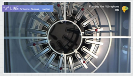
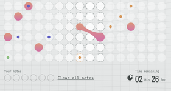
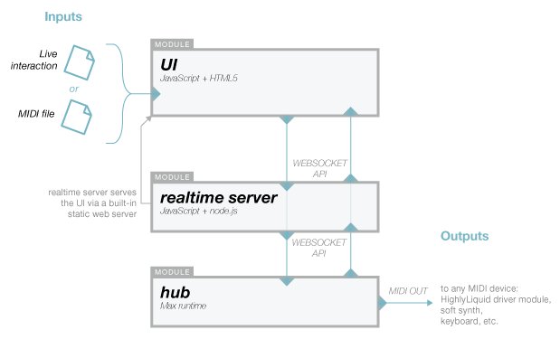

# Orchestra

## Warnings and Disclaimers

**WARNING** **WARNING** **WARNING** **WARNING**

Moving machines can cause damage to personal property, personal injury or death. It is the responsibility of the reader of this document to take adequate safety precautions when operating, designing, or building any machinery, or when offering machinery to others for use.

None of the software, documents, firmware, schematics, drawings or other materials accompanying this document have been checked for errors, omissions or mistakes of any kind. Use it at your own risk.

Your use of the software, documents, firmware, schematics, drawings or other materials accompanying this document is governed by the [License Agreement](../LICENSE.txt). Read it before proceeding.

## Contents

* [History, Concept and Intent](#history-concept-and-intent)
* [What is the Orchestra system](#what-is-the-orchestra-system)
* [This Document](#this-document)
* [Architecture](#architecture)
* [Getting Started](#getting-started)
* [Reference](#reference)
	* [Requirements and Dependencies](#requirements-and-dependencies)
	* [Configuration](#configuration)

Copyright Notice:
Copyright 2013 Google Inc. All other copyrights and trademarks are property of their respective owners.

----------------------------------------------------------------

## History, Concept and Intent

The Universal Orchestra was originally conceived as one of five experiments devised for an interactive exhibit at the [Science Museum, London](http://www.sciencemuseum.org.uk/) called [Chrome Web Lab](http://www.chromeweblab.com/). These five experiments were created to demonstrate how modern Web technologies can be used together for purposes that go beyond “normal” webapps.  

Chrome Web Lab was made by Google Creative Labs, Tellart, B-Reel, Universal Design Studio, Fraser Randall, MAP, Karsten Schmidt, Weir+Wong and Bibliotheque. These five experiments can be accessed in person by visiting the Science Museum in London or over the web at [chromeweblab.com](http://www.chromeweblab.com/). Chrome Web Lab will run from July 2012 until July 2013.

Orchestra is designed for people across the world to make music collaboratively. Online visitors interact with Orchestra by selecting notes on a web-based time scale for a particular instrument. As the sequencer loops, it reads the selected note and then triggers the appropriate actuator for the instrument at the Science Museum in London.

   

The intent of this open source project is to release the base software system for a collaborative, real time loop sequencer to control physical hardware.

----------------------------------------------------------------

## What is the Orchestra system?

The Web Lab Orchestra allows multiple users to control physical hardware,
collaboratively and in real time, using a browser-based loop sequencer interface.

This repository contains all the [software](sw) you need to run your own version,
plus some instructions to help you get started with your own [hardware](hw).

## This Document

In this document we will look briefly at how the Orchestra system is organized, followed by step-by-step instructions for getting started.

## Architecture

The system is organized into modules, each of which has a specific purpose. The modules communicate with each other via web sockets and MIDI. When the optional live video+audio components are used then either WebRTC or Adobe's proprietary RTMP streaming protocol are used (depending on your setup).



- The **UI** is an HTML5 frontend (which is served via and communicates with
  the realtime server)
- The **realtime server** is a Node.js backend which accepts WebSockets
  connections from the other components, keeping them all in sync
- The **hub** is a combination of Python-based daemon and Max patch which commands MIDI hardware based on state data from the realtime server

Optionally, the system can be configured to stream live audio and video from one computer back to the UI. This is intended to allow someone to play an instrument in one location from a computer in another location and be able to hear the results.

The live audio and video streaming components can be configured to use the WebRTC standard, or use Flash video. The WebRTC setup is preferred because it involves running fewer pieces of software. However, WebRTC is in active development so its performance today may still have much room for improvement.


## Getting Started

### Assumptions

> These instructions assume:
* ...you will be running all software on a **single** computer which is running either Linux or Mac OS X. We will call this "the computer" from now on. The components can also be configured to each run on different hosts
(as they do in [the Chrome Web Lab](http://www.chromeweblab.com/)).
See the [Configuration](#configuration) section below.
* ...you have some development knowledge (ideally in JavaScript, Python and Max) and are comfortable typing commands into a shell or the Mac OS X Terminal.
* ...you have already cloned, forked or downloaded the [project repository](../../) onto the computer. If you haven't, just download it [here](../../archive/master.zip). You can also click the "Code" link at the top of this page and look at all of the cloning and forking options available.

### Running

The Orchestra project contains a git submodule for the signalmaster WebRTC component. It is important to understand that there are some potential issues when using git submodules. Please read this [note from the git documentation](http://git-scm.com/book/en/Git-Tools-Submodules#Issues-with-Submodules) before proceeding. Essentially, though, if you don't use branches within the submodule then you should be safe.

Before start any of the Orchestra components, please update the repository's submodules via the GitHub app, or by running this shell command from the repository [root folder](../):

`git submodule update --init`


#### Realtime server

1. Download and install the latest version of Node.js from [this page](http://nodejs.org/).
2. Start a shell or Terminal and change to the [**sw/realtimeserver** folder](sw/realtimeserver).
3. Run
    ```
    node server.js
    ```

The server's websocket connection will now be available at `localhost:8080`.

You may run it locally or on a 3rd party host such as Joyent.

#### Hub

1. You will need Cycling 74's [Max](http://cycling74.com/products/max). If you do not have Max already, you can download a [free trial of the full product](http://cycling74.com/downloads/). There is likely a time limit on the free trial. You can also get their free [runtime](http://cycling74.com/downloads/runtime/) which will let you use the Hub, but won't let you edit it.
2. Read our guide on [how we configured Max](MAX.md)
3. Open [sequencer.maxpat](Orchestra/sw/hub/max/sequencer.maxpat), from the [sw/hub/max](Orchestra/sw/hub/max) folder, in Max, the main Max patch. **Note**: Max will allow you to open and run more than one copy of the same file. Please Make sure only one copy of the sequencer patch
is running at a time!
4. Double-click the `[noteout]` box and make sure your MIDI interface is selected.
(If you have a full version of Max, you can pre-configure this.)

You may stop and re-start the sequencer with the space bar.

The Python portion of the Hub is started separately:

1. Start a shell or Terminal and change to the [**sw/hub** folder](sw/hub).
2. Then, to start the Python daemon, run:
      ```
      ./script/start.sh
      ```
    
    To stop it, run:
      ```
      ./script/stop.sh
      ```

You can tail the server logs in `log/twistd.log`.

#### Streaming Audio and Video

Streaming live audio and video of the orchestra back to the UI is optional. If you want to use this component you first need to chose if you will use WebRTC or Flash video. See the [Architecture](#architecture) and [Streamer Requirements and Dependencies](#streamer) sections for a description of the options.

##### WebRTC

1. The [signalmaster](https://github.com/andyet/signalmaster) WebRTC signalling application is included as a submodule in this repository so that you should not need to manually download the source. If for some reason you need it, the **signalmaster** repository can be cloned or downloaded from GitHub at [https://github.com/andyet/signalmaster](https://github.com/andyet/signalmaster).
2. Start a shell or Terminal and change to the the [main repository folder](../).
3. Run this command to make sure that your copy of **signalmaster** is up-to-date: `git submodule update`. **NOTE**: If please be sure to run `git submodule update --init` if you have just cloned the repository.
4. Change to the the [Orchestra/sw/streamer/signalmaster](sw/streamer/signalmaster) folder.
5. Install its dependencies by running `npm install`.
6. Make sure the realtime server is running. If it is not, see the [realtime server section above](#getting-started).
7. Start **signalmaster** by running `node server.js` from the [Orchestra/sw/streamer/signalmaster](sw/streamer/signalmaster) folder.
8. Then open `http://localhost:8081/webrtc-streamer` in Chrome. You will be prompted to allow camera access. A pull-down menu allows you to select which instrument to stream to.

Multiple streamers may access the same camera on the same computer, if you would like all instruments to display the same stream.

You can now skip ahead to the [UI section](#ui).

##### Flash video

If you have already set up WebRTC video streaming you can skip ahead to the [UI section](#ui).

These instructions assume you will be using the open source Red5 Flash-compatible media server. Other systems, such as Adobe's Flash Media Server, should also work, though we do not have instructions for them here.

1. Download and install the version 1.0 of the Red5 server from [this page](http://www.red5.org/red5-server/)
2. Start a shell or Terminal. `cd` to the Red5 directory and run
    ```
    ./red5.sh
    ```

2. We now must set up the default webapp. Once the server has booted up, go to
  [http://localhost:5080/installer](http://localhost:5080/installer)
  in your browser
3. Install `oflaDemo` (checking the File Name column to make sure it's
  the right one). After doing this once, the webapp will remain installed in this Red5 deployment.

4. Download and install Adobe's Flash Media Live Encoder (FMLE) from [this page](http://www.adobe.com/products/flash-media-encoder.html).
5. Start FMLE.
6. Load the streaming profile included with the Orchestra system by opening [`stream-to-local-red5.xml`](sw/streamer/stream-to-local-red5.xml) in FMLE.
7. click Start to begin streaming

To set up multiple streamers locally, the simplest would be to have each
streamer on a separate machine, with its own copy of FMLE and Red5.
You may of course run all of the streams (from multiple instances of FMLE)
through a single Red5 or Flash Media Server if you wish; however, the
configuration for that scenario is not provided here.

Or you can simply use one video stream for all clients by duplicating
the RTMP URLs in `VideoStreamPaths.js` (see **Configuration** above).

#### UI

1. Make sure the realtime server is running. If it is not, see the [realtime server section above](#getting-started).
2. Open `http://localhost:8081/ui` in Chrome.

There you will see menus to select which instrument you'd like to play,
and what type of video stream (if any) you'd like to sync to.

**Note**: If you don't use any video stream, it is highly recommended that you
run the **UI** Chrome clients on the same local network as the **hub**, and slave 
them to the **hub** machine via NTP. (This is easily done on Mac OS by entering
the **hub**'s IP in the `Set date and time automatically` field in
`System Preferences` > `Date & Time` on the Chrome client machine.) This ensures
that their system clocks are in sync, so that the timing of the sequencer on
the screen matches the timing of the **hub** playback.

##### Importing MIDI files

You can import a MIDI clip by dropping a MIDI file on the file input.

The MIDI file _must_ be in this format:

- Two bars of 4/4 (i.e. 8 quarter notes)
- Quantized to eighth notes
- Counting up from middle C (a.k.a. MIDI pitch 60)

### Sound

Once you've got all the software components up and running, you can begin to
work on the sound of the music that's played back.

#### Soft synth

If you just want to hear something play back without setting up any hardware,
you can download a software synthesizer (or "soft synth"). There are many
options, some of which are standalone, some of which require a plugin (e.g. VST)
host. One good standalone synth for Mac + Windows is
[circle](http://www.futureaudioworkshop.com/circle/).

By default, the MIDI pitches output by the Hub are all sequential, i.e., the
chromatic scale. (See [playback.js](sw/hub/max/playback.js).). You can map them
to a different tuning in [pitch-mappings.txt](sw/hub/max/pitch-mappings.txt),
which is a list of key-value pairs in Max's `coll` file format. So to map MIDI
pitch 61 to pitch 62, you would do:

    61, 62;

If a mapping is not present for a specific pitch, the original pitch is output.

### Physical actuators

If you'd like to experiment with building your own actuated instruments, please
see the [hardware documentation](hw).


----------------------------------------------------------------

## Reference

### Requirements and Dependencies

#### Realtime server

The server is built on [Node.js](http://nodejs.org/), with no package dependencies.

#### Hub

The Hub consists of two subcomponents—a **Python WebSockets client** and a
**Max patch**, which communicate with one another locally via UDP (OpenSoundControl).
The motivation for this duality is to combine the benefits of MaxMSP's musically-precise
timing with Python's robust networking functionality.

##### Python

The Python client has been tested with [Python 2.7](http://www.python.org/download/releases/2.7/),
using [twistd](http://twistedmatrix.com/documents/current/core/howto/basics.html) to run as a daemon.

To install the required Python packages, first [install pip](http://www.pip-installer.org/en/latest/installing.html)
(using `get-pip.py` or otherwise). Once pip is installed:

1. Open the Terminal or shell and change to the [Orchestra/sw/hub](sw/hub) folder
2. Run this command from that folder:

    `sudo pip install -r requirements.txt`

You may instaed install the individual Python packages listed in [Orchestra/sw/hub/requirements.txt](sw/hub/requirements.txt).

##### Max

You may use either the full or free Runtime version of
[Max 5.1.9](http://cycling74.com/downloads/older/).

#### Streamer

You may select one of two video streaming platforms: Flash video or WebRTC.

Flash video is used in [the Chrome Web Lab](http://www.chromeweblab.com/),
as it can be synced to sequencer data from the realtime server in the UI.

**Caveat emptor**: WebRTC video has no mechanism to sync the audio/video stream
with the note sequencer (as Flash video does), so it will have a noticeable
delay with regards to the sequencer, especially on the open internet.

##### WebRTC

The browser JavaScript for broadcasting and viewing WebRTC streams,
[a custom fork of SimpleWebRTC](https://github.com/Tellart/SimpleWebRTC),
is included in this repository, so you don't need to install anything.

SimpleWebRTC has a companion Node.js backend (for signaling in between browsers)
called [signalmaster](https://github.com/andyet/signalmaster). It is recommended
that you clone it from GitHub and install its dependencies using
[`npm`](https://npmjs.org/).

##### Flash video

If you won't be using WebRTC you can also use Flash video to stream. For this, you'll need an encoder to capture the video from the camera and a Flash Media Server to relay the stream to the end client.

For Flash video, the Orchestra works with Adobe's 
[Flash Media Live Encoder 3.2](http://www.adobe.com/products/flash-media-encoder.html).

The [Red5 Media Server 1.0](http://www.red5.org/) is an open source alternative
to Adobe's commercial Flash Media Server product.

You may of course use a paid streaming host in the cloud, but do make sure the latency is
as low as possible (ideally not more than a few seconds).


#### UI

A modern HTML5-compatible browser, such as [Chrome](http://www.google.com/chrome) or [Webkit](http://www.webkit.org/)
is required to use the UI. The UI prioritizes experimentation and ease of disassembly, and does
not contain any complex code to make it work in older browsers.


### Configuration

#### Deploying components on different hosts

Unless you are running all components of the Orchestra on a single host, you
will need to configure each to point to certain others.

If you deploy the **realtime server** on a separate host:

- In the **hub**, update the `host` in [app.yml](sw/hub/config/app.yml)
- In the **UI**, update the `REALTIME_SERVER_HOST` in
  [OrchestraConfiguration.js](sw/realtimeserver/static/ui/js/weblab/orchestra/OrchestraConfiguration.js)

If you are using Flash video, and move the Red5 or Flash Media Server to another host:

- In the streamers, update the Primary Streaming Server in each instance of FMLE
- In the **UI**, update `LOW_LATENCY_URLS` (and `LOW_LATENCY_IDS` as needed) in
  [OrchestraConfiguration.js](sw/realtimeserver/static/ui/js/weblab/orchestra/OrchestraConfiguration.js)
  (There should be one stream per instrument)

If you are using WebRTC, and move the Node.js signaling server to another host:

- In the **UI**, update `WEBRTC_SIGNALING_URL` in
  [OrchestraConfiguration.js](sw/realtimeserver/static/ui/js/weblab/orchestra/OrchestraConfiguration.js)
  (affects **streamers**, too)

#### Modifying the default number of instruments or pitches

- In the **realtime server**, update [configuration.js](sw/realtimeserver/weblab/configuration.js)
- In the **UI**, update
  [OrchestraConfiguration.js](sw/realtimeserver/static/ui/js/weblab/orchestra/OrchestraConfiguration.js)
  (and search for `NUMBER_OF_PITCHES` in [orchestra.css](sw/realtimeserver/static/ui/css/orchestra.css))
- In the **hub** update `PITCHES_PER_INSTRUMENT` in [playback.js](sw/hub/max/playback.js)

