# MIDI Whirlophone

**WARNING** **WARNING** **WARNING** **WARNING**

Moving machines can cause damage to personal property, personal injury or death. It is the responsibility of the reader of this document to take adequate safety precautions when operating, designing, or building any machinery, or when offering machinery to others for use.

None of the software, documents, firmware, schematics, drawings or other materials accompanying this document have been checked for errors, omissions or mistakes of any kind. Use it at your own risk.

Your use of the software, documents, firmware, schematics, drawings or other materials accompanying this document is governed by the [License Agreement](../LICENSE.txt). Read it before proceeding.

All trademarks are the property of their respective owners.

## Introduction
This an example of a 'musical' instrument that can be developed using the Chrome Web Lab's Orchestra system. For a full description of the history and concept of the project, see [this page](https://github.com/GoogleChrome/ChromeWebLab/tree/master/Orchestra).

But we're here to make something. Specifically, this thing:

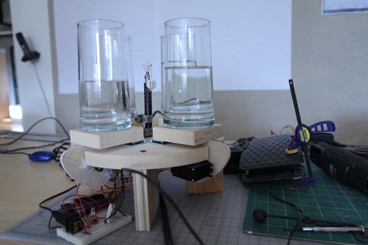

A MIDI-controlled whirlophone. A MIDI-controlled servo/percussive tonal experience, powered by a hobby rotary power tool.

A striker (bead on string) continuously spins in the center of an arrangement of water-filled drinking glasses. As notes are played in the Orchestra software, the glasses are moved into the path of the spnning striker producing sound.

The speed of the spinning bead is *not* tied to the tempo or rhythm of the music. It has a sort of "tremmolo" effect because the bead continuously strikes the glass as long as the note is playing.

It looks like [this (video)](http://youtu.be/MxbYEo85gAY) when it is running.

## Materials

The first step is to acquire all of the parts we will need to build this project. 

Tools:

* Safety goggles
* Band saw or handheld jigsaw
* Scissors
* Hot glue gun and a little bit of hot glue
* Wire cutter/stripper

###Electronic Components

| Quantity | Description |
|----------|-------------|
| 1        | USB MIDI interface &mdash; look around, there are [some inexpensive ones out there](https://www.google.com/search?biw=1025&bih=760&tbm=shop&q=usb+midi+interface) |
| 1        | Standard Male/Male [MIDI cable](https://www.google.com/search?q=midi+cable&source=univ&tbm=shop) |
| 1        | Arduino &mdash; nearly any will do, such as the [Leonardo](http://store.arduino.cc/ww/index.php?main_page=product_info&cPath=11_12&products_id=226) |
| 4        | Standard 6V metal gear hobby servos* &mdash; [such as these](https://www.sparkfun.com/products/10333) 
| 1        | [DIN 5/180 MIDI Connector](https://www.sparkfun.com/products/9536) |
| 1        | [6N138 Optocoupler](http://www.digikey.com/product-detail/en/6N138-000E/516-1600-5-ND/825236) |
| 1        | [L7806CV voltage regulator](http://www.digikey.com/product-detail/en/L7806CV/497-1445-5-ND/585966) |
| 1        | 220ohm resistor |
| 1        | 270ohm resistor |
| 2        | 100ohm resistors |
| 1        | 1kOhm resistor |
| 1        | [1N914 diode](http://www.digikey.com/product-detail/en/1N914/1N914FS-ND/978749) |
| 1        | 9v battery |
| 1        | 9v battery harness &mdash; such as [this one](http://www.radioshack.com/product/index.jsp?productId=2062219) |
| spool    | Red hookup wire |
| spool    | Black hookup wire |
| 1        | [breadboard](https://www.sparkfun.com/products/9567) |

*We used 7.4V servos and powered them on a separate supply from the Arduino. Typically powering servos through the Arduino is not a good idea unless they are very small or you only need to power one or two.

###Other materials

| Quantity | Description |
|----------|-------------|
| 4        | Drinking glasses, roughly 3" diameter base &mdash; any kind will do, really |
| 1        | [Dremel hobby tool with flex shaft, or similar motorized rotary tool](https://www.google.com/search?q=dremel+tool+with+flex+shaft) |
| 1        | approx. 10" diameter circular base (ours is wood, 3/4" thick) &mdash; you can cut one yourself from plywood, use some found object, or perhaps get [something like this](http://www.joann.com/unfinished-mdf-plaque-1-pkg-circle-10-/zprd_12200804a/) |
| quarter-sheet | Quarter sheet of 3/4" plywood &mdash; we used scrap wood we had laying around, enough for 4 3" squares, and 4 3/4" x 3/4" x 1" blocks |
| quarter-sheet | 3/16" plywood for cams (1/8" would work), a 3" x 10" piece is plenty |
| 1 box    | [Thumb Tacks](http://www.officedepot.com/a/products/323873/OIC-Thumb-Tacks-No-2-38/) |
| | Masking Tape |
| 1        | Small wooden bead |
| a few inches | Cotton twine |
| 4        | 3" narrow hinges with screws &mdash; [like these](http://www.homedepot.com/p/Everbilt-3-in-Zinc-Plated-Non-Removable-Pin-Narrow-Utility-Hinges-2-Pack-15168/202033931#.UgQn92Tm3kg) |
| 1        | 1 1/2" L bracket with screws &mdash; [like these](http://www.homedepot.com/p/Everbilt-1-1-2-in-Zinc-Plated-Corner-Braces-4-Pack-15304/202033892#.UgTjnWSfF68) |
| 2        | 1/2" - 1 1/4" hose clamps &mdash; [like these](http://www.homedepot.com/p/Ideal-1-2-1-1-4-in-Hose-Repair-Clamp-6712595/202309385#.UgTmBGSfF68)

## Electronics

* Following the diagram, assemble the the MIDI input circuit.
 * 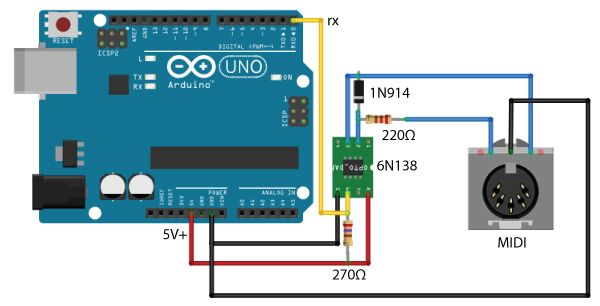
* Following the diagram, assemble the servo circuit.
 * Your signal pins (depicted in yellow) should connect to the digital PWM pins 3, 5, 6 and 9 on the Arduino board.
 * 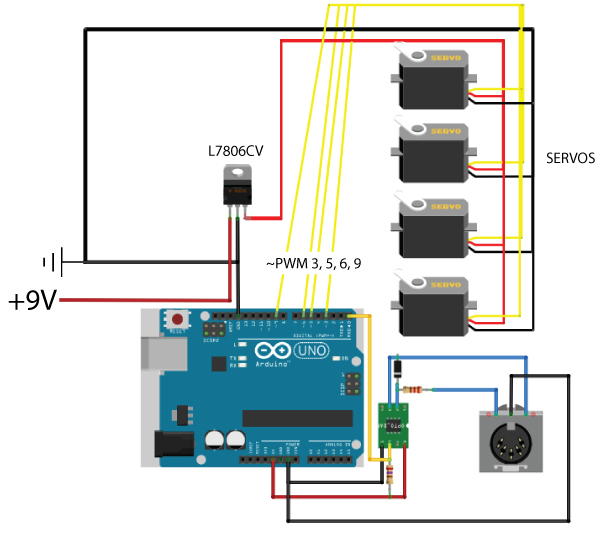
 * Note that your power requirements for the servos will vary based on the type of servo you use. Once you figure out the power requirements of your motors you can adjust the voltage from your power source using a [linear regulator](http://en.wikipedia.org/wiki/Linear_regulator).

## Building the Base

**Important**: Always wear safety goggles while using power tools. In fact, you should wear safety goggles while using this instrument.

* Layout on Circular Base
 * We're going to lay out all the cutlines on the circular base first. First, draw two perpendicular diameters.
 * Make a mark at 2" and 2-1/4" in from the circle's edge along each line. The 2" mark is where we'll drill a clearance hole. The 2-1/4" mark is an alignment mark for the hinges.
 * Draw a 1/2" slot from the edge of the disc to the 2-1/4" mark.
 * Draw a line perpendicular to the 2-1/4" mark, this will align our hinges.
 * The finished layout should look like this:
 * 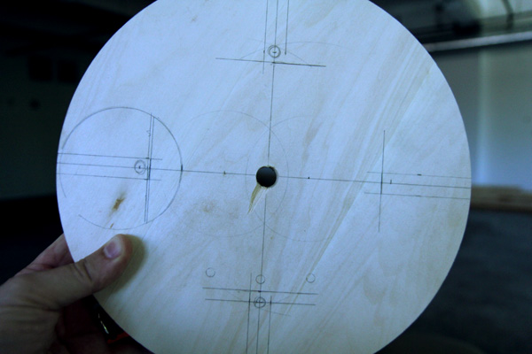

* Drill and Cut Slots
 * Drill the center hole of the disc so that it accomodates the shaft of your rotary tool. Ours was  1/2".
 * Go ahead and mark the L-bracket position now. The L-bracket holds the flex shaft straight and vertical during operation. 
 * Hold the shaft in what you think will be the final position, press the L-bracket against it tightly and mark the screw holes.
 * Drill 1/2" holes at the 2" marks on your disc.
 * Next use a band saw or jig saw to cut along the slot lines until you hit the hole you just drilled.
 * The finished disc will look like this:
 * 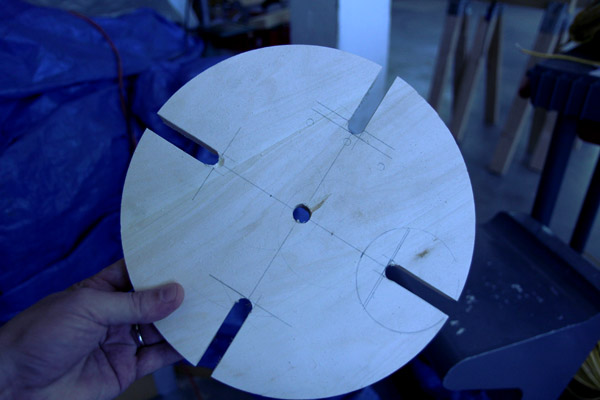

* Cut Cam and other Parts
 * The cam is a simple ovoid shape. Hold the servo flat against the bottom of the slotted disc.
 * Measure from the center point of the servo shaft to the top of the slotted disc. This will give you the base circle of the cam. Ours was 1-1/8". The long axis of the cam is arbitrary. Make it as long as you want your hinged plate to rise. We picked 2-3/8".
 * Here's the cam laid out:
 * 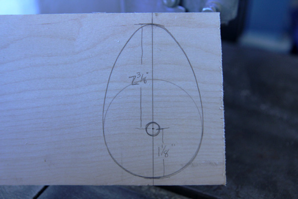
 * Cut out the cam and sand the edges so there are no rough edges.
 * Drill the center hole large enough for the shaft of the servo's double arm horn to fit through. 

* Now cut the other wood parts. You'll need four 3" x 3" pieces for bases for the glasses and eight 3/4" x 3/4" x 1" pieces for the servo supports:
 * 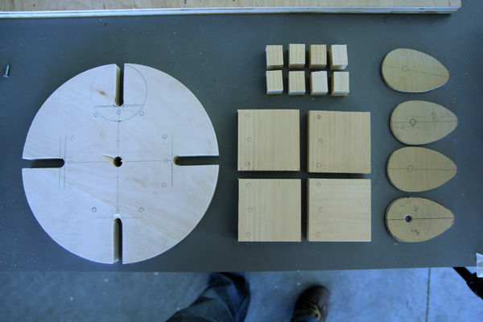

* Predrill for Screws
 * The pine that we used is very prone to breaking, so you need to predrill all of your screw holes.
 * Align your hinges centered on the 2-1/4" marks on your disc and mark and drill the holes.
 * Align the hinges with the glasses base plates and mark and drill those holes.
 * Hold the support blocks against the servos and mark where the screws will go and drill those holes.

* Attach Servos to base
 * Assemble 1 cam and put it on one of the servos.
 * Place it inside the slot so that the cam can move freely.
 * Mark the servo position and the servo shaft line. These will help alignment when attaching the servos.

* It is easier at this point to attach the servo supports to the servos and then attach that to the base rather than the other way around: 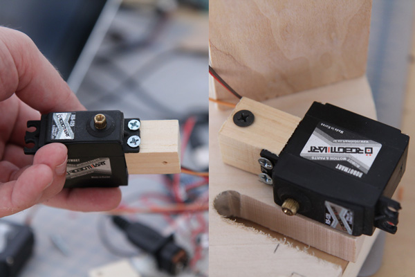

* Attach cams to servos
 * There are probably better ways to attach the cam to the servo, but this is the way we did it.
 * Place the double harm horn into the hole of the cam.
 * Press two thumb tacks through the outermost holes in the horn.
 * Cover with masking tape:
 * 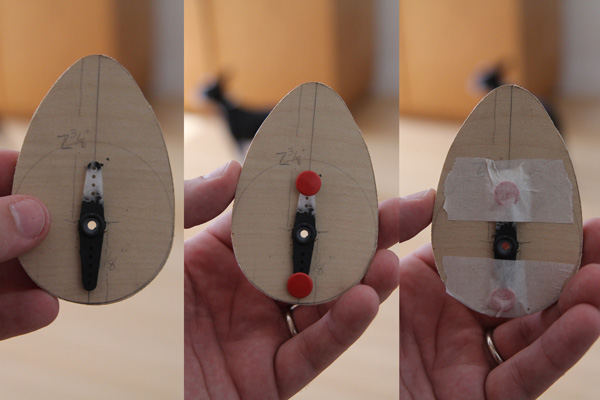
 * Press the horn onto the servo and tighten the screw to the servo shaft.

* Attach Hinges to Base
 * Screw the hinges to the base pieces for the glasses.
 * Then, attach the other half of the hinge to the circular base:
 * 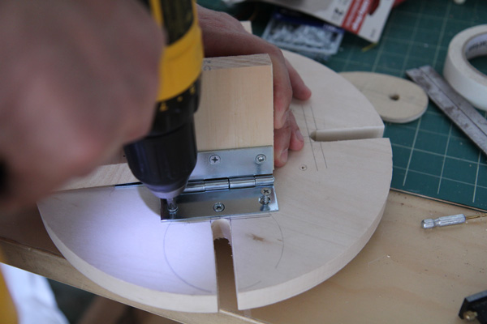

* Attach Base Legs
 * The machine will need some support. The height of the legs will vary depending on your flex shaft and your servos. Ours were 3" tall. We attached them with 1-1/4" drywall screws.
 * We can also go ahead and attach the L-bracket where we marked it earlier near the center hole:
 * 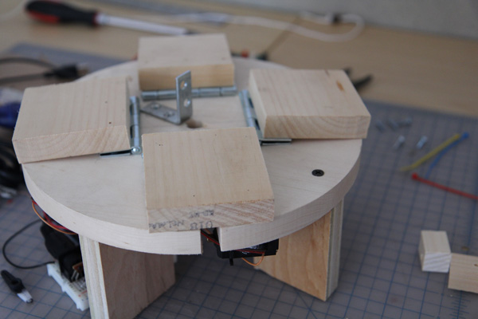

* Connect wiring
 * Thread the flex shaft through the center hole. Make it as straight and vertical as possible.
 * Tighten hose clamps to hold it in place:
 * 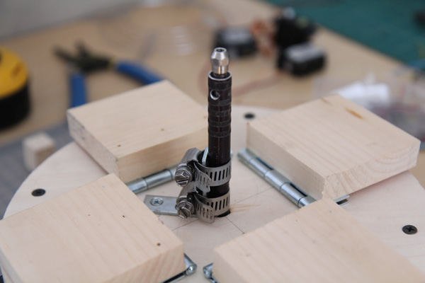
 * If not attached already, attach all of your servo wiring to the breadboard:
 * 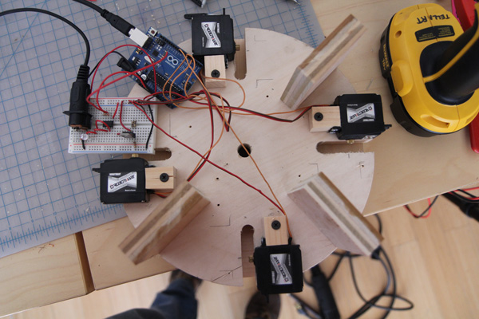

* Glue Glasses
 * Again, there may be more elegant ways of attaching the glasses, but this is what we did.
 * Hot glue the glasses down to the hinged bases.
 * Fill them with various levels of water for different tones.

* Make Threaded Bead
 * The striker needs to be hard enough to strike the glasses solidly, but not so hard the the glasses will break. We decided to cover a wooden bead with cotton twine. It provides a nice solid strike.
 * Depending on how thick your twine is, you might need to ream out the hole in the wooden bead to a slightly larger diameter.
 * Be careful, though, because they break quite easily.
 * If you have a sewing needle with an eye thick enough for your twine, use that, otherwise fashion a 'sewing needle' from a paper clip.
 * Straighten the paper clip out and then fold it back on itself with a small 'eye' left in the bend.
 * Thread your twine through the eye.
 * Now just pass your needle through the center hole of the bead as many times as you can:
 * 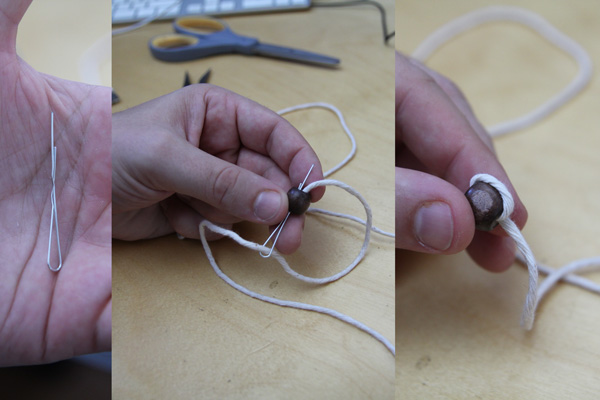
 * As you continue threading it will become harder and harder to pull the twine through. Needle nose pliers will aid at this point.
 * Make as many wraps as you can. The more fully the bead is covered, the more consistent the sound will be and the less likely it will be to crack your glasses: 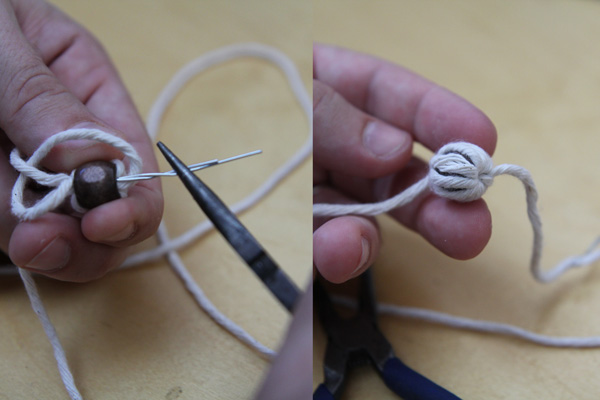
 * The twine is so tight in the bead that you can just trim off the excess to make a nice tight ball. Cut the other end so you have about 4" of twine left.
 * We used two small washers on a screw-top mandrel to hold the twine. Slip the thread in between the two washers and tighten the screw just enough to hold the twine.
 * Before tightening fully, take the striker over to the instrument and check to see the length that you need. You want the striker to come as close to the glasses as possible without striking them. When you get the length correct, tighten down the screw and trim off the excess twine.
 * Here is what it looks like when complete:
 * 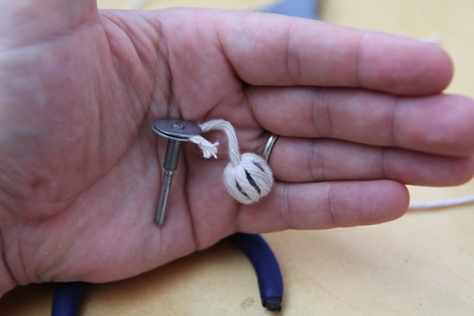

* Fire it up and tune!
 * Make sure the Arduino is connected to your computer's USB port for power. We will not be using the USB connection for data, however. It is merely to power the Arduino.
 * Connect your USB MIDI adaptor to the computer.
 * Connect the MIDI cable between the 'MIDI OUT' port on the adaptor and the MIDI jack on the breadboard.
 * If you haven't already, connect the battery for your servos. The glasses should all move out away from the center of the circle at this point.
 * *Put on your safety goggles!*
 * Turn on the power to your Dremel to *LOW SPEED*. The bead should start spinning around, but just barely *miss* hitting the glasses. If it does, turn off the Dremel and adjust the length of the twine on the bead.
 * Start the Orchestra software and load the UI in Chrome.
 * Tip: check that the MIDI output from your USB adaptor is selected in the Max window for the Orchestra Synthesizer.
 * As you turn on/off notes on the grid, the glasses should move into/out of the path of the spinning bead and make a sound.
 * If the bead doesn't hit the glasses when notes are turned on, then adjust the length of the twine accordingly.
 * Add water a little at a time to the glasses to adjust the sound of each note. An eyedropper is handy for removing excess water.
 * Think about other things besides glasses of you could use to make interesting sounds.
 * Also think about the fact that this is a generic MIDI instrument. You can use it with other MIDI software as well.

