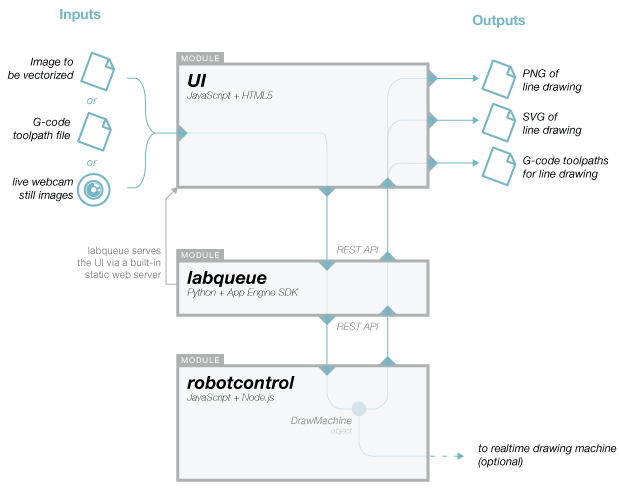
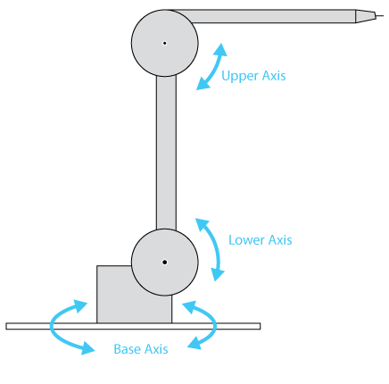
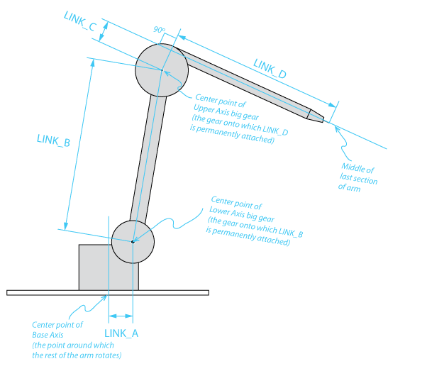

# Sketchbots

## Warnings and Disclaimers

**WARNING** **WARNING** **WARNING** **WARNING**

Moving machines can cause damage to personal property, personal injury or death. It is the responsibility of the reader of this document to take adequate safety precautions when operating, designing, or building any machinery, or when offering machinery to others for use.

None of the software, documents, firmware, schematics, drawings or other materials accompanying this document have been checked for errors, omissions or mistakes of any kind. Use it at your own risk.

Your use of the software, documents, firmware, schematics, drawings or other materials accompanying this document is governed by the [License Agreement](../LICENSE.txt). Read it before proceeding.

## Contents

* [History, Concept and Intent](#history-concept-and-intent)
* [What is the Sketchbots system](#what-is-the-sketchbots-system)
* [This Document](#this-document)
* [Architecture](#architecture)
* [Getting Started: Basic Setup](#getting-started-basic-setup)
* [Reference](#reference)
	* [Requirements and Dependencies](#requirements-and-dependencies)
	* [Startup and Shutdown](#startup-and-shutdown)
	* [UI Reference](#ui-reference)
	* [labqueue Reference](#labqueue-reference)
	* [robotcontrol Reference](#robotcontrol-reference)

Copyright Notice:
Copyright 2013 Google Inc. All other copyrights and trademarks are property of their respective owners.

----------------------------------------------------------------

## History, Concept and Intent

The Sketchbots were originally conceived as one of five experiments devised for an interactive exhibit at the [Science Museum, London](http://www.sciencemuseum.org.uk/) called [Chrome Web Lab](http://www.chromeweblab.com/). These five experiments were created to demonstrate how modern Web technologies can be used together for purposes that go beyond “normal” webapps.  

Chrome Web Lab was made by Google Creative Labs, Tellart, B-Reel, Universal Design Studio, Fraser Randall, MAP, Karsten Schmidt, Weir+Wong and Bibliotheque. These five experiments can be accessed in person by visiting the Science Museum in London or over the web at [chromeweblab.com](http://www.chromeweblab.com/). Chrome Web Lab will run from July 2012 until July 2013.

Web visitors interact with Sketchbots by first taking a photo of their face via a webcam. Software then renders the image into a line drawing. This line drawing is sent to a Sketchbot, which resides at the Science Museum in London, whereupon the Sketchbot draws the visitor's portrait in a sandbox.


The intent of this open source project is to release the base software system to render line drawings and create output to drive drawing machines.

----------------------------------------------------------------

## What is the Sketchbots system?

The Sketchbots system is a set of modules which automatically generate contour line drawings based on photographs (and other kinds of source images). These line drawings are saved in various file formats. Optionally, the software can control certain kinds of machines which "perform" drawings, for example by dragging a stylus around in a bed of sand.

This repository contains the system software. That software consists of:
* an HTML5-based Web [**UI**](sw/ui)
* [**labqueue**](sw/labqueue): a server for holding a queue of drawings to be processed
* [**robotcontrol**](sw/robotcontrol/src): a piece of software which processes the drawings

Also included are specs for building a compatible drawing machine.

Most of the software is written in JavaScript (the **UI** and **robotcontrol** modules) and Python (the **labqueue** module).

## This Document

In this document we will look briefly at how the Sketchbots system is organized, followed by step-by-step instructions for getting started.

## Architecture

The system is organized into modules, each of which has a specific purpose. The modules communicate with each other via standard HTTP.



The [**UI**](sw/ui) is an HTML5 frontend (which is served via and communicates with labqueue).

Since a big benefit of using modern web technologies is scalability, the system uses **labqueue** as a central work queue for drawings which need to be processed. The queue holds things called **drawing tasks**. A drawing task is a data record containing everything there is to know about a particular drawing (source image, date/time, etc.). Multiple users with multiple different user interfaces can add/remove/view drawing tasks in the queue via **labqueue**'s REST interface.

At the same time, the **robotcontrol** continually accesses **labqueue** to be _assigned_ drawing tasks to work on. In the language of the queue/worker design pattern, **robotcontrol** is the worker. It accesses **labqueue** via the same REST interface as the **UI** (though **robotcontrol** tends to use some different methods than the UI). Once **robotcontrol** has been assigned a task it works on the task until it is complete. If it is interrupted or crashes during this time it can start up again and work on the same task. Meanwhile, the **UI** can continue to add or change drawing tasks independently.

Incidentally, one could even run multiple copies of **robotcontrol** to process multiple tasks simultaneously. There were 8 copies running in parallel for the Chrome Web Lab project.

When [**robotcontrol**](sw/robotcontrol/src) completes a drawing task it generates different kinds of output. This output is a combination of "soft output," meaning digital output and "hard output," meaning work done on physical machines.

robotcontrol will *always* generate the following soft output:
* a PNG image showing the line drawing
* an SVG image of the line drawing
* a [g-code toolpath file](http://en.wikipedia.org/wiki/G-code) of the drawing

All of the soft output is available locally on the computer running **robotcontrol** and is also posted back to **labqueue**. Because it is available on **labqueue**, other software can be developed which does even more with the output. For that matter, **robotcontrol** could be completely replaced or supplemented by other software which is written to use the **labqueue** REST interface.

The "hard output" from **robotcontrol** comes in the form of realtime control of a robot (more properly called a _drawing machine_). Because, at the moment, there is little true standardization for controlling robotic machine systems, and because someone might wish to add support for new types of machines, **robotcontrol** has an abstraction layer called DrawMachine. The configuration file for **robotcontrol** can specify the type of any JavaScript object to use as the DrawMachine. As long as this object has an expected set of methods and behavior (essentially, an interface, if JavaScript had such things), then the rest of **robotcontrol** will happily use this object to perform drawings. A DrawMachine object encapsulates the hardware-specific communication and logic for a certain type of machine. Put another way, DrawMachines are sort of like drivers for drawing machines.

**robotcontrol** comes with the following DrawMachines:
* NoMachine - a "soft machine" which does not require any actual hardware. This is a simulated drawing machine.
* HomebrewGalil - supports machines built on Galil's line of [Econo motion controllers](http://www.galilmc.com/products/econo.php)
* MindstormsNXT - supports machines built with the [LEGO Mindstorms NXT system](http://mindstorms.lego.com/)

New DrawMachines can be created by cloning and modifying NoMachine.

Overall, the system is designed as a set of loosely-coupled pieces which use standard communication as much as possible. Information tends to flow from the **UI**, through the **labqueue**, to **robotcontrol**, where it is processed and the results returned to **labqueue** (presumably for use in the UI and beyond). Along the way, **robotcontrol** can command a drawing machine to "perform" the drawing in realtime.

## Getting Started: Basic Setup

These instructions are intended to get the whole Sketchbots system up and running as quickly as possible. Initially we will set it up using the NoMachine DrawMachine, so that it will not require a drawing machine to be connected. Connection to a drawing machine is discussed in [a subsequent section](#connecting-a-drawing-machine).

### Assumptions

> These instructions assume:
* ...you will be running all software on a **single** computer which is running either Linux or Mac OS X. We will call this "the computer" from now on.
* ...you have some development knowledge (ideally in JavaScript and Python) and are comfortable typing commands into a shell or the Mac OS X Terminal.
* ...you have already cloned, forked or downloaded the [project repository](../../) onto the computer. If you haven't, just download it [here](../../archive/master.zip). You can also click the "Code" link at the top of this page and look at all of the cloning and forking options available.

### Installing labqueue and the UI

1. Download and install the Google App Engine SDK for Python from [this page](https://developers.google.com/appengine/downloads#Google_App_Engine_SDK_for_Python).
2. Start App Engine Launcher (Google's GUI control panel for the App Engine development server).
3. From the **File** menu, select **Add Existing Application...**.
4. Click the **Browse...** button and select the [Sketchbots/sw/labqueue](sw/labqueue/) folder.
5. Click the **Add** button to finish adding the **labqueue** source to App Engine Launcher.
6. Select the newly added **labqueue** application in the list, then, from the **Edit** menu, select **Application Settings...**.
7. In the **Application Settings** dialog, under **Launch Settings** turn OFF the **Clear datastore on launch** option.
8. (**Only required for App Engine versions lower than 1.7.7) In the **Extra Flags** field enter `--use_sqlite` to use a local sqlite database to simulate Google's datastore system.
9. Set the **Port** to 8080.
10. Click the **Update** button to save changes to the Application settings.
11. With **labqueue** still selected in the list, select the **Control** menu and then **Run**. After some startup time, the application should begin running and you will be rewarded with a circular, green arrow icon next to the application name in the list.
    * **Troubleshooting**: If you do **not** see the green icon next to **labqueue** then there may be a configuration problem. From the **Control** menu, select **Logs** and look at the most recent output. If you cannot proceed, create a new GitHub [issue](../../issues) and someone will try to help.

> #### Stop and test
> 
> Let's make sure that everything is working so far.
> 
> From the App Engine Launcher **Control** menu, select **Browse**. Your default browser should now open and display the default Sketchbots UI. For a brief period after loading you should see "Successfully connected to labqueue" below the "Sketchbots" title of the page.
>
> **Troubleshooting**:
> * If your browser times out without showing the UI, make sure that the development server is actually running by ensuring that the **Run** menu is grayed-out under **Control**. 
> * If a page loads, but contains an error (such as 500) check the logs as described in step 11.
>


### Installing robotcontrol

1. Download and install the latest version of Node.js from [this page](http://nodejs.org/).
2. **robotcontrol** depends on node-canvas, which, in turn depends on: `pkg-config`, `Pixman`, and `Cairo`. Install these dependencies by following the instructions on the node-canvas GitHub project's wiki [for Mac OS X](https://github.com/LearnBoost/node-canvas/wiki/Installation---OSX) (and [other operating systems](https://github.com/LearnBoost/node-canvas/wiki)).
    - Tips:
        + You will need `libpng` **before** you install `cairo`. You may already have it installed, but if not a binary version of `libpng` for Mac OS X is available [here](http://ethan.tira-thompson.com/Mac_OS_X_Ports.html).
        + When installing on OS X, try using `sudo make install` rather than simply `make install` for the dependencies. By default they will attempt to install in `/usr/local/` which is read-only for normal users.
        + Log out and logging back in (or just re-open Terminal) after installing `pkg-config`. This will make sure you have the right environment variables set and fix potential issues installing dependencies that use `pkg-config`.
3. Start a shell or Terminal and change to the [**robotcontrol/src** folder](sw/robotcontrol/src).
4. Run `npm install` to install **robotcontrol**'s dependencies. These modules will be stored in the **robotcontrol/src/node_modules** folder.
    * **Troubleshooting:** npm will now install the additional packages. Some of these require native code libraries (e.g. [canvas](https://github.com/LearnBoost/node-canvas)). If you have trouble building any of these check the module's page on [npmjs.org](https://npmjs.org/) for additional help.
5. Open the [**ConfigParams.js**](sw/robotcontrol/src/ConfigParams.js) file in a text editor.
6. Locate the **LABQUEUE_PORT** setting. Make sure that it is set to the number from step 9 in **Install labqueue and the UI**. The default should be 8080. The value should be a number, **not** a string.
7. Locate the `DRAW_MACHINE_TYPE` setting. You should see more than one possible setting in the file, with all but one commented out. Make sure the uncommented setting is ```DRAW_MACHINE_TYPE: "NoMachine",``` In the future this is where you can enable one of the real drawing machines. For now, though, we will work with the NoMachine simulated drawing machine.
8. Save changes to ConfigParams.js.


> #### Stop and test
>
> Now we should test that **robotcontrol** is nominally functional.
> 
> 1. In the shell, change to the [**robotcontrol/** folder](sw/robotcontrol) (one level up from the **src** folder).
> 2. Run `./start_robot_control`
> 3. Assuming you have not created any new drawings with the UI, you should start to see the message "Checking server for a new drawing task offer..." approximately every 4 seconds.
>


### Putting it all together

Now that everything is running we will test the full system end-to-end.

1. Switch to the UI in your browser. If it is not running, go to App Engine Launcher, select **labqueue** and click the **Browse** button.
2. Click the **New from Web Cam** button.
3. Your browser should now ask you for permission to use your local camera. Allow this access.
4. Smile at the camera and click the **Take Photo** button.
5. Review your picture and retake if desired. Click the **Save** button.
6. A few seconds later your picture should appear under the **Queue** heading in the UI.
7. Switch to the window showing **robotcontrol**.
8. You should now see a lot of output in the **robotcontrol** window as it downloads your photo from **labqueue**, traces an outline drawing and updates the drawing task in **labqueue**.
9. Switch back to your browser.
10. You should now see that your photo has disappeared from the **Queue** section and moved to the **Completed** section.

If you saw everything as described, then the system should be basically working. If you saw some unexpected results, review the Getting Started instructions for troubleshooting help. If you are still stuck, create a new [issue](../../issues) to get  help.


<!--
## Getting Started: Using a Drawing Machine

These instructions build upon the [Basic Setup](#getting-started-basic-setup) by adding a simple LEGO Mindstorms NXT drawing machine. For more information on this type of drawing machine see [MindstormsNXT DrawMachine](#mindstormsnxt-drawmachine) in the reference section.

We will use the community-developed [pbLua firmware](http://hempeldesigngroup.com/lego/pblua) for the NXT "brick", rather than the stock LEGO firmware.

You will need the following materials to complete this setup:
* A LEGO Mindstorms NXT building kit. LEGO Mindstorms NXT kits are readily available online.
* Other miscellaneous LEGO bricks are handy, such as from the Technic sets
* A good metric ruler or, better still, a good metric [dial caliper](http://en.wikipedia.org/wiki/Caliper#Dial_caliper). Yes, you should use metric units.

1. Build a 3-axis drawing machine as described the [LEGO Mindstorms NXT drawing machine build instructions](hw/MindstormsNXT/README.md). Also review the description of the [MindstormsNXT drawing machine software module](#mindstormsnxt-drawmachine) in the reference section.
2. If you haven't done so already, make sure that the basic LEGO Mindstorms NXT software is installed and running properly on your computer. Instructions are included in the Mindstorms NXT box and on [LEGO's web site](http://mindstorms.lego.com/en-us/support/buildinginstructions/8547/8547%20user%20guide%20english.aspx).
3. Follow [these instructions](http://hempeldesigngroup.com/lego/pblua/tutorial/pbluainstall/) to install the pbLua firmware on the NXT brick.
4. Open the [ConfigParams.js](sw/robotcontrol/src/ConfigParams.js) file from the [robotcontrol/src](sw/robotcontrol/src/) folder.
6. Locate the `DRAW_MACHINE_TYPE` setting. Make sure it is set as follows: ```DRAW_MACHINE_TYPE: "MindstormsNXT",``` 
7. If you built your drawing machine according to the instructions referenced in step 1, above, then the robot geometry settings included in ConfigParams.js can be used as-is. If you modified the machine or want to understand these settings in more detail, please see the [DrawMachine Geometry Configuration section](#drawmachine-geometry-configuration).
8. Connect the NXT brick to the computer via USB or Bluetooth. See your computer operating system's documentation for details on how to create a Bluetooth connection.
9. Determine the name of the serial port by looking in the **/dev** directory in a shell or Mac OS X terminal. For Bluetooth devices, the port is usually called **/dev/cu.NXT-DevB**.
10. Back in ConfigParams.js, set the `MINDSTORMS_NXT__SERIAL_PORT` to the name of the serial port from step 10.
11. Save changes to ConfigParams.js.

> #### Stop and test
>
> Now we should re-test the entire system to make sure that it still works.
> 
> 1. In the shell, change to the [**robotcontrol/** folder](sw/robotcontrol) (one level up from the **src** folder).
> 2. Run `./start_robot_control`
> 3. You should see the following message in the console: `********************** Connected to MindstormsNXT drawing machine **********************`
> 4. You should also see "Sketchbot OK" on the Mindstorms NXT brick LCD display. **Troubleshooting**: If you do not see *both* the message in the console on the computer and on the LCD, then you may have the wrong serial port configured in ConfigParams.js. Review Step 9 above and try again.

> 5. Switch to the UI running in your browser. If the UI is not running, switch to App Engine Launcher, select *labqueue* and press the *Run* button. Click the *Browse* button to display the UI in your browser.
> 6. Click the *New from File* button
> 7. Select the [testpattern.png](sw/test/testpattern.png) file which is part of this repository. You can find it in the [sw/test](sw/test) folder.
> 8. Click the *Save* button
> 9. A few seconds later **robotcontrol** should pick up the new drawing task and begin commanding the drawing machine.
> 
> **Troubleshooting**: 
> 	* If **robotcontrol** does not detect the new drawing task then there may be a fundamental misconfiguration in **robotcontrol** itself. Review the [Getting Started: Basic Setup](#getting-started-basic-setup) instructions.
> 	* If **robotcontrol** detects the new task but the robot does not start drawing then review the troubleshooting tips for step 3 in this test procedure.
> 	* If the drawing machine starts drawing but does not draw correctly, you may need to check the physical build of the machine. Review the [build instructions here](hw/MindstormsNXT/README.md). You should also re-check the dimensional and gear ratio settings as shown in step 7, above.
> 

-->

----------------------------------------------------------------

## Reference

### Requirements and Dependencies

Some of the Sketchbot software components require additional software or libraries to run.

**To actually install these requirements, jump down to the Installation section. It includes step-by-step instructions which include the installation of all of these requirements.** The list here is primarily for quick reference.

#### UI

The UI is served from the **labqueue** app, and so it requires the same things as labqueue. Additionally,
a modern HTML5-compatible browser, such as [Chrome](http://www.google.com/chrome) or [Webkit](http://www.webkit.org/)
is required to use the UI. The UI prioritizes experimentation and ease of disassembly, and does
not contain any complex code to make it work in older browsers.

#### labqueue

labqueue requires the [Google App Engine SDK for Python](https://developers.google.com/appengine/downloads#Google_App_Engine_SDK_for_Python). You can run **labqueue** in the local App Engine
development server. It is also possible to run it on [appengine.google.com](https://appengine.google.com),
though that is a more advanced configuration.

#### robotcontrol

robotcontrol requires [Node.js](http://nodejs.org/) and npm (which is usually installed with Node), as well as some other
NPM packages. A list of these packages can be found in robotcontrol's
[package.json](sw/robotcontrol/src/package.json) file.
All of the dependencies can be installed by running `npm install` from the **robotcontrol/src** folder.

### Startup and Shutdown

Startup is simply a matter of starting both **labqueue** and **robotcontrol**.

1. Start **labqueue** by running App Engine Launcher, selecting **labqueue** and clicking the **Run** button.
2. Start **robotcontrol** by running `./start_robot_control` in the [**robotcontrol/** folder](sw/robotcontrol) folder.

Shutdown is similarly simple:

1. Stop **labqueue** by selecting **labqueue** in App Engine Launcher, and clicking the **Stop** button.
2. Stop **robotcontrol** by typing ctrl+c to terminate Node.js (or send node a **break** signal some other way)

----------------------------------------------------------------

### UI reference

#### UI Configuration Reference

There are minimal configuration options provided for the included UI. These are found in [Config.js](sw/ui/controller/Config.js).

----------------------------------------------------------------

### labqueue Reference

#### labqueue Configuration Reference

labqueue's configuration file is [config.py](sw/labqueue/config.py). See comments in the file for a description of its use.

#### REST API Reference

*Important*: When sending a GET or POST to the API, be sure to wrap string parameter values in quotes so that the system can distinguish them from the special boolean values true and false. For example, to pass the string "bob" as value of the parameter worker_guid, you would send:

```
&worker_guid="bob"
```

You would *not* send `&worker_guid=bob`.

All methods return 200 status on successful requests, or an error status. All responses are JSON-encoded as an object. Look at the *result* property of the returned object for the data returned by the called method.

In the reference below request parameters expected by each method are identified `:like_this:` and the text after describes the expected value. Optional parameters are marked as such; all others are required, and omitting them will cause an error.

##### [GET] /api/test
```
test URL, only useful to verify that the server is running
```


##### [GET] /api/time
```
returns the current time

{"result":{"server_time_utc":1365134558,"server_time_utc_human":"2013-04-05 04:02:38.994045","runtime":8.00000000001e-06}}
```


##### [GET] /api/workers/all/status
```
Returns a list of worker status information. A worker not in the list
has never been seen.

:activity_space:
    Optional. A string indicating the space for which you want status information.
    If specified, must be one of the strings in config.VALID_ACTIVITY_SPACES:
        "www"   - for the frontend web site
        "lon"   - for the London Science Museum

:touchpoint:
    Optional. A string indicating the touchpoint with which the tag was last active. Must be one
    of the strings in config.VALID_TOUCHPOINT_NAMES
```


##### [GET] /api/workers/guid/status
Substitute the ID of a worker for guid.
```
Returns the current status of the specified worker.
```


##### [POST] /api/workers/guid/status
Substitute the ID of a worker for guid.
```
Allows a worker to set their own status message.

:message:
    A status message.
```


##### [GET] /api/topics
```
Gets a list of available Topics, optionally paginating the results.

:num:
    Optional. The maximum number of objects to return in the list. Defaults to unlimited,
    however this may cause the query to time out before completion.

:start:
    Optional. A number specifying which object in the list to start with,
    expressed as an offset from the start of the list.

:order:
    Optional. If specified, will try to order the list by the property specified.
    To order in reverse, precede the property name with a minus sign.
    
    For example, to sort alphabetically by the GUID of the Worker which created
    each Topic, set order to "created_by". To sort that in reverse order
    set order to "-created_by"

* Raises a TypeError if start or num are not numbers
* Raises an ValueError if start or num are negative
```


##### [POST] /api/topics
```
Create and save a Topic.

:worker_guid:
    The GUID of the Worker which is creating this Topic

:name:
    The name of the new Topic
    
:task_policy:
    (Optional) An object which defines the policy for Tasks in this topic.
    The object may have the following key/value pairs:
        'max_num_tasks'             Specify an integer to cap
                                    the max number of new tasks
                                    to allow each hour. The timing
                                    of the cap is NOT rolling;
                                    instead it works as a number
                                    of slots which are released at
                                    the top of each hour and used
                                    as needed.
        'can_cache'                 If True, the system will run new
                                    and stopped Tasks through the
                                    CacheWorker from the cloudworker service.
        

* Raises an InvalidWorkerGUIDError if assignee_guid is invalid per the criteria in exception.ex_check_worker_guid_and_raise()

* Raises an InvalidTopicNameError or BadKeyError if the supplied name is invalid per exception.ex_check_topic_name_and_raise()

* Raises a TopicAlreadyExistsError if a Topic already exists with the same name

* Raises an InvalidTopicTaskPolicyError if the task_policy is invalid per 
```


##### [GET] /api/topics/topicname
Substitute the name of a queue topic, e.g. sketchbot-drawings, for topicname.
```
Gets information about the specified queue.

:include_rejected:
    Optional. If True, will allow retrieval of objects which have been rejected by a moderator.
```


##### [GET] /api/topics/topicname/num_recent_tasks
Substitute the name of a queue topic, e.g. sketchbot-drawings, for topicname.
```
Returns the number of tasks recently created in a
particular topic.
```


##### [GET] /api/topics/topicname/num_creatable_tasks
Substitute the name of a queue topic, e.g. sketchbot-drawings, for topicname.
```
Returns the APPROXIMATE number of available "slots" if this
topic uses the 'max_num_tasks' task policy rule. If this topic
does not use this policy rule then this method will return a very
large number.
```


##### [GET] /api/topics/topicname/num_creatable_tasks
Substitute the name of a queue topic, e.g. sketchbot-drawings, for topicname.
```
If this topic uses the 'max_num_tasks' task policy rule,
returns the maximum number of tasks in a state other than
STOPPED_SUCCESS or STOPPED_FAILURE allowed per hour. If this topic
does not use that task policy rule, then this method will return
a very large number.
```


##### [GET] /api/topics/topicname/offers
Substitute the name of a queue topic, e.g. sketchbot-drawings, for topicname.
```
A Worker wants a new task. Do something about it!
This could even be a worker we already assigned a task to (it forgot about it, needs a reminder).

A Worker will never be assigned a task created by itself.

This method will load an appropriate Task object, alter it to indicate that it is being offered
to a particular Worker, and save it.

It will return the offered Task or, if no suitable Task is available, this method returns None.

:assignee_guid:
    the GUID of a Worker, the one which is posting this new task
    The Task model record will have this value assigned to a StringProperty,
    so this needs to be string-like

* Raises an InvalidWorkerGUIDError if assignee_guid is invalid per the criteria in exception.ex_check_worker_guid_and_raise()
```


##### [GET] /api/topics/topicname/tasks
Substitute the name of a queue topic, e.g. sketchbot-drawings, for topicname.
```
Gets a list of Tasks, optionally paginating the results.

:num:
    Optional. The maximum number of objects to return in the list. Defaults to unlimited,
    however this may cause the query to time out before completion.

:start:
    Optional. A number specifying which object in the list to start with,
    expressed as an offset from the start of the list.

:order:
    Optional. If specified, will try to order the list by the property specified.
    To order in reverse, precede the property name with a minus sign.
    
    For example, to sort alphabetically by the GUID of the Worker which created
    each object, set order to "created_by". To sort that in reverse order
    set order to "-created_by"

:filter_state:
    Optional. Specifies a filter for the 'state' property of all Tasks in the list.
    
    The filter is specified as an array in the form:
        [op,value]

    ...where op is a string having one of the following values:
        "=","!=",">",">=","<","<="

    ...and value is any value.
    
    When the list of objects is being generated, each object's 'state' property
    will be compared to the value specified in the filter, using the op in the filter.

    For example, if the parameter is set to ["=","Foo"] then only objects having a
    'state' of "Foo" will be included.

:filter_assigned_to:
    Optional. Specifies a filter for the 'assigned_to' property of all Tasks in the list.
    See the filter_state argument for details on how to use a filter.

:filter_created_by:
    Optional. Specifies a filter for the 'created_by' property of all Tasks in the list.
    See the filter_state argument for details on how to use a filter.
    

* Raises a TypeError if start or num are not numbers
* Raises an ValueError if start or num are negative
* Raises a PropertyError if order is specified, but is not a valid property of the objects being listed
```


##### [POST] /api/topics/topicname/tasks
Substitute the name of a queue topic, e.g. sketchbot-drawings, for topicname.
```
Create a new Task in this Topic, to be done by a Worker. Returns a Task which has already been stored in the datastore.

:created_by_guid:
    the GUID of a Worker, the one which is posting this new task
    The Task model record will receive have this value assigned to a StringProperty,
    this needs to be string-like

:payload:
    A string containing any related data.

:do_not_store_artifact:
    If True, the Worker performing the Task should not store any artifacts from the
    work, other than what gets put into this Task object upon completion.

:make_reservation:
    Optional, may not be used with claim_reservation_id.
    If True, the Task created will be a reservation which can later be turned into
    a full task using claim_Task_reservation().

:claim_reservation_id:
    Optional, may not be used with make_reservation.
    If provided, will attempt to retrieve the reserved Task with this id. If the Task
    still has a valid reservation, its payload and artifact storage settings will be
    replaced and updated--thus turning the reservation into a POSTED_NEW Task.
    If the reservation is invalid for whatever reason, this method will attempt to
    create a new Task as if claim_reservation_id had been None.

* Raises an InvalidWorkerGUIDError if assignee_guid is invalid per the criteria in
  exception.ex_check_worker_guid_and_raise()

* Raises an InvalidPayloadError if the payload is invalid per the criteria in
  exception.ex_check_payload_and_raise()
  
* Raises an ArgumentError if both make_reservation and claim_reservation_id are used 
  at the same time
```


##### [GET] /api/topics/topicname/rejected_tasks
Substitute the name of a queue topic, e.g. sketchbot-drawings, for topicname.
```
Gets a list of Tasks which have been rejected by a moderator.

:num:
    Optional. A limit on the number of tasks to retrieve.
```


##### [GET] /api/topics/topicname/rejected_tasks/count
Substitute the name of a queue topic, e.g. sketchbot-drawings, for topicname.
```
Gets a count of Tasks which have been rejected by a moderator.

:num:
    Optional. A limit on the number of tasks to retrieve.
```


##### [GET] /api/topics/topicname/waiting_tasks
Substitute the name of a queue topic, e.g. sketchbot-drawings, for topicname.
```
Gets a list of Tasks which are waiting to be accepted by a worker.

:num:
    Optional. A limit on the number of tasks to retrieve.
```


##### [GET] /api/topics/topicname/waiting_tasks/count
Substitute the name of a queue topic, e.g. sketchbot-drawings, for topicname.
```
Gets the number of Tasks which are waiting to be accepted by a worker.

:num:
    Optional. A limit on the number of tasks to count.
```


##### [GET] /api/topics/topicname/working_tasks
Substitute the name of a queue topic, e.g. sketchbot-drawings, for topicname.
```
Gets a list of Tasks which are waiting to be accepted by a worker.

:num:
    Optional. A limit on the number of tasks to retrieve.
```


##### [GET] /api/topics/topicname/working_tasks/count
Substitute the name of a queue topic, e.g. sketchbot-drawings, for topicname.
```
Gets the number of Tasks which are waiting to be accepted by a worker.

:num:
    Optional. A limit on the number of tasks to count.
```


##### [GET] /api/topics/topicname/successful_tasks
Substitute the name of a queue topic, e.g. sketchbot-drawings, for topicname.
```
Gets a list of Tasks which are stopped in a successful state.

:num:
    Optional. A limit on the number of tasks to retrieve.
```


##### [GET] /api/topics/topicname/failed_tasks
Substitute the name of a queue topic, e.g. sketchbot-drawings, for topicname.
```
Gets a list of Tasks which are stopped in an unsuccessful state.

:num:
    Optional. A limit on the number of tasks to retrieve.
```


##### [GET] /api/topics/topicname/tasks/taskid
Substitute the name of a queue topic, e.g. sketchbot-drawings, for topicname.
Substitute the numeric ID of a task, e.g.. 1054, for taskid
```
Gets a single Task object.

:include_rejected:
    Optional. If True, will allow retrieval of objects which have been rejected by a moderator.
```


##### [POST] /api/topics/topicname/tasks/taskid/do:accept
Substitute the name of a queue topic, e.g. sketchbot-drawings, for topicname.
Substitute the numeric ID of a task, e.g.. 1054, for taskid
```
Indicates that a Worker has accepted the assignment of a task.

This method will check that the Task has been properly offered to
the indicated Worker, alter the Task to indicate the worker has accepted it and save the Task.

It returns nothing.

:assignee_guid:
    the GUID of the worker accepting the new Task
    The Task model record will receive have this value assigned to a StringProperty,
    this needs to be string-like

:est_stop_at:
    The date/time when the Worker estimates the task will be complete. If a number, this value will
    be interpreted by datetime.datetime.utcfromtimestamp() (see http://docs.python.org/library/datetime.html#datetime.datetime.utcfromtimestamp).
    If a string, this value will be interpreted by datetime.datetime.strptime() (see http://docs.python.org/library/datetime.html#datetime.datetime.strptime)
    and will expect the string to be in the format "%a %b %d %H:%M:%S %Y"
    

* Raises an InvalidWorkerGUIDError if assignee_guid is invalid per exception.ex_check_worker_guid_and_raise()

* Raises a TaskNotOfferedError if the Worker was not offered the task (including if it
was offered to a different Worker)

* Raises an InvalidEstimatedStopError if est_stop_at is invalid per exception.ex_check_est_stop_and_raise()

* Raises a WrongTaskStateError if the task is not in a state allowing it to be accepted.
```


##### [POST] /api/topics/topicname/tasks/taskid/do:decline
Substitute the name of a queue topic, e.g. sketchbot-drawings, for topicname.
Substitute the numeric ID of a task, e.g.. 1054, for taskid
```
Indicates that an assigned Worker cannot accept the offered Task. The system may
offer it again to a different Worker later.

It returns nothing.

:assignee_guid:
    the GUID of the worker declining the new Task

* Raises an InvalidWorkerGUIDError if assignee_guid is invalid per exception.ex_check_worker_guid_and_raise()

* Raises a TaskNotOfferedError if the Worker was not offered the task (including if it
was offered to a different Worker)

* Raises a WrongTaskStateError if the task is not in a state allowing it to be declined.
```


##### [POST] /api/topics/topicname/tasks/taskid/do:delegate
Substitute the name of a queue topic, e.g. sketchbot-drawings, for topicname.
Substitute the numeric ID of a task, e.g.. 1054, for taskid
```
Indicates that an assigned Worker wants the task it was assigned to be delegated
to a different Worker (to be chosen by the TaskRouter using some internal logic).

This method will check that the Task has been assigned to
the indicated Worker, alter the Task to indicate that it has been delegated and save it.
It will then post a new Task on the indicated Worker's behalf, with the same topic and
payload as the delegated Task.

It will return the delegated Task upon success or raise an exception upon failure.

:assignee_guid:
    the GUID of the worker delegating the Task
    The Task model record will receive have this value assigned to a StringProperty,
    this needs to be string-like

* Raises a TaskNotAssignedError if the Worker is not the one assigned to the task (including if it
is not assigned or is assigned to a different Worker)

* Raises an InvalidWorkerGUIDError if assignee_guid is invalid per exception.ex_check_worker_guid_and_raise()

* Raises a WrongTaskStateError if the task is not in a state allowing delegation.
```


##### [POST] /api/topics/topicname/tasks/taskid/do:progress
Substitute the name of a queue topic, e.g. sketchbot-drawings, for topicname.
Substitute the numeric ID of a task, e.g.. 1054, for taskid
```
Indicates that the Worker has a progress report on its Task. This will either indicate
good forward progress toward successful completion or a warning that something is wrong
(but not wrong enough to warrant stopping the task -- see stop(). It also requires that the
Worker give an estimated time at which it will successfully complete the Task.

This method will check that the Task has been assigned to
the indicated Worker, alter the Task to record the progress report and save it.

It returns nothing.

:assignee_guid:
    the GUID of the worker providing the progress report
    The Task model record will receive have this value assigned to a StringProperty,
    this needs to be string-like

:progress_message:
    some message from the Worker about the Task's current progress
    The Task model record will receive have this value assigned to a StringProperty,
    this needs to be string-like

:progress_payload:
    Optional. If specified, will replace the Task payload with the supplied object.
    This should be the entire payload object, with any incremental updates.
    If omitted, the task payload will remain as specified by the Task's creator.

:est_stop_at:
    Optional. The date/time when the Worker estimates the task will be complete. If a number, this value will
    be interpreted by datetime.datetime.utcfromtimestamp() (see http://docs.python.org/library/datetime.html#datetime.datetime.utcfromtimestamp).
    If a string, this value will be interpreted by datetime.datetime.strptime() (see http://docs.python.org/library/datetime.html#datetime.datetime.strptime)
    and will expect the string to be in the format "%a %b %d %H:%M:%S %Y". If omitted,
    the task will keep the estimate stop time given when the task was accepted.

:assignee_state:
    an optional object which the assignee can use to store some information about
    its state at the time this progress report was made. This object should be simple enough
    that it can be JSON-encoded (not pickled)

:warning:
    whether or not this progress is a warning of a (possible) problem, will be interpreted as a boolean


* Raises a TaskNotAssignedError if the Worker is not the one assigned to the task (including if it
is not assigned or is assigned to a different Worker)

* Raises an InvalidWorkerGUIDError if assignee_guid is invalid by the criteria in exception.ex_check_worker_guid_and_raise()

* Raises an InvalidMessage if the progress_message is invalid by the criteria in exception.ex_check_message_and_raise()

* Raises an InvalidEstimatedStopError if est_stop_at is invalid by the criteria in exception.ex_check_est_stop_and_raise()

* Raises a WrongTaskStateError if the Task cannot currently receive a progress report.
```


##### [POST] /api/topics/topicname/tasks/taskid/do:stop
Substitute the name of a queue topic, e.g. sketchbot-drawings, for topicname.
Substitute the numeric ID of a task, e.g.. 1054, for taskid
```
Indicates that the Worker has stopped work on the specified Task. The condition of the stop
is either success or failure, and the Worker can include a message describing something about the
stop. The Task's payload can also be updated at the time of a stop.

This method will check that the Task has been assigned to
the indicated Worker, alter the Task to mark it as stopped (and set the message, payload) and save it.

It returns nothing.

:assignee_guid:
    the GUID of the worker stopping the Task
    The Task model record will receive have this value assigned to a StringProperty,
    this needs to be string-like

:success:
    whether or not this is a successful stop (True) or a failure (False)
    Interpreted as a bool

:stop_message:
    a message from the Worker about the stop
    The Task model record will receive have this value assigned to a StringProperty,
    this needs to be string-like

:payload:
    Optional. If specified, this object becomes the new value for the Task's Payload object
    (presumably it will bear some resemblance to what it was when the Task started). The object
    should be simple enough that it can be JSON-encoded (not pickled).
    If no payload is specified the existing payload of the Task will remain unchanged.

* Raises a TaskNotAssignedError if the Worker is not the one assigned to the task (including if it
is not assigned or is assigned to a different Worker)

* Raises an InvalidWorkerGUIDError if assignee_guid is invalid per exception.ex_check_worker_guid_and_raise()

* Raises an InvalidPayloadError the new payload is invalid per exception.ex_check_payload_and_raise()

* Raises a WrongTaskStateError if the Task cannot be stopped.
```


##### [POST] /api/topics/topicname/tasks/taskid/do:stop
Substitute the name of a queue topic, e.g. sketchbot-drawings, for topicname.
Substitute the numeric ID of a task, e.g.. 1054, for taskid
```
Rejects a task on moderation grounds
```


##### [POST] /api/bin
Substitute the name of a queue topic, e.g. sketchbot-drawings, for topicname.
```
Create a new LabDataContainer or update an existing one.

:worker_guid:
    The GUID of the Worker creating this LabDataContainer.

:name:
    Optional. If provided, this will be the name of the new LabDataContainer. If omitted, the system will
    assign a unique name to the new LabDataContainer.

:unlisted:
    Optional. Boolean. Whether or not this LabDataContainer should be unlisted. Unlisted LabDataContainers
    do not appear in the query returned by LabDataContainer.get_child_LabDataContainers_query()
    and should always be omitted from user-facing lists of data.

:description:
    Optional. A text description of what this LabDataContainer is for.

:content:
    Optional. The first piece of content to store in this LabDataContainer.

:content_type:
    Optional. The MIME type of the content. If None and content is specified,
    then we will try to detect an appropriate type based on the Python type of the
    content argument.

:content_latitude:
    Optional. If appropriate, the content can be tagged with a map latitude.

:content_longitude:
    Optional. If appropriate, the content can be tagged with a map longitude.

:content_timezone:
    Optional. If appropriate, the content can be tagged with a timezone name. See http://pytz.sourceforge.net/#tzinfo-api for information
    on valid timezone names.
    
:decode_base64_before_saving:
    Optional. If True and the content argument is a string, the method will first interpret the
    content argument as a Base64 string, and use the decoded data as the actual content.

:app_timestamp:
    Optional. If specified, allows storing a application-defined timestamp for the content of this LabDataContainer.
    The value is not used internally by the API. It is indexed, however, and can be used freely by an application
    accessing the API.

:updated_space:
    Optional. A string indicating the space in which LDC was updated. If specified, must be one of the strings
    in config.VALID_ACTIVITY_SPACES

:updated_touchpoint:
    Optional. A string indicating the touchpoint in use when this LDC was updated. If specified, must be one of the strings
    of the strings in config.VALID_TOUCHPOINT_NAMES


:allow_overwrite:
    Optional. If False, will raise an error if attempting to write to a record which already exists.

* Raises an InvalidWorkerGUIDError if the specified Worker's GUID is invalid
* Raises a ContainerAlreadyExistsError if there is already a child LabDataContainer with the same name
* Raises a InvalidPathError if the name of the child is invalid
* Raises an InvalidTouchpointError if the updated_touchpoint argument is invalid.
```


##### [GET] /api/bin/objid
Substitute the numeric ID of a binary object, e.g. 1435, for objid
```
Gets a single object.

:include_rejected:
    Optional. If True, will allow retrieval of objects which have been rejected by a moderator.
```


##### [POST] /api/bin/objid
Substitute the numeric ID of a binary object, e.g. 1435, for objid
```
Modify this LabDataContainer.

:worker_guid:
    The GUID of the Worker creating this LabDataContainer.

:mod_flagged:
    Optional. Sets whether this content is flagged for moderation.

:mod_rejected:
    Optional. Sets whether this content has been rejected by a moderator.
    Setting mod_rejected to True will automatically set mod_approved to False.

:mod_approved:
    Optional. Whether or not the content has been approved by a moderator.
    Setting mod_approved to True will automatically set mod_rejected to False.
    If both mod_approved and mod_rejected are True, only mod_rejected will be set.

:unlisted:
    Optional. Boolean. Whether or not this LabDataContainer should be unlisted. Unlisted LabDataContainers
    do not appear in the query returned by LabDataContainer.get_child_LabDataContainers_query()
    and should always be omitted from user-facing lists of data.

:description:
    Optional. A text description of what this LabDataContainer is for.

:content:
    Optional. The first piece of content to store in this LabDataContainer.

:content_type:
    Optional. The MIME type of the content. If None and content is specified,
    then we will try to detect an appropriate type based on the Python type of the
    content argument.

:content_latitude:
    Optional. If appropriate, the content can be tagged with a map latitude.

:content_longitude:
    Optional. If appropriate, the content can be tagged with a map longitude.

:content_timezone:
    Optional. If appropriate, the content can be tagged with a timezone name. See http://pytz.sourceforge.net/#tzinfo-api for information
    on valid timezone names.
    
:decode_base64_before_saving:
    Optional. If True and the content argument is a string, the method will first interpret the
    content argument as a Base64 string, and use the decoded data as the actual content.

:app_timestamp:
    Optional. If specified, allows storing a application-defined timestamp for the content of this LabDataContainer.
    The value is not used internally by the API. It is indexed, however, and can be used freely by an application
    accessing the API.

:updated_space:
    Optional. A string indicating the space in which LDC was updated. If specified, must be one of the strings
    in config.VALID_ACTIVITY_SPACES

:updated_touchpoint:
    Optional. A string indicating the touchpoint in use when this LDC was updated. If specified, must be one of the strings
    of the strings in config.VALID_TOUCHPOINT_NAMES


* Raises an InvalidTouchpointError if the updated_touchpoint argument is invalid.
* Raises an InvalidWorkerGUIDError if the specified Worker's GUID is invalid
```


##### [POST] /api/bin/objid/do:delete
Substitute the numeric ID of a binary object, e.g. 1435, for objid
```
Marks an LDC for culling by the deletion daemon.
```


##### [POST] /api/bin/objid/content
Substitute the numeric ID of a binary object, e.g. 1435, for objid
```
Sets the data content of this LabDataContainer.

:content:
    The content to store in this LabDataContainer. If None, will remove the LabDataContainer's
    content. Setting content to None does NOT remove child LabDataContainers.

:content_type:
    The MIME type of the content. If None and content is specified,
    then we will try to detect a type based on the Python type of the content argument.
        
    At the moment, this detection works as follows:
        
        If type(content) is...      Then a content_type set to None will be set to...
        str                         'text/plain'
        unicode                     'text/plain; charset=UTF-8'
        anything else               'application/octet-stream'
        
    However, this detection may change in the future. The best bet is to
    explicitly define the content type by giving content_type a value.
    
:decode_base64_before_saving:
    Optional. If True and the content argument is a string, the method will first interpret the
    content argument as a Base64 string, and use the decoded data as the actual content.
```


##### [GET] /api/bin/objid/content
Substitute the numeric ID of a binary object, e.g. 1435, for objid
```
Returns an object representing the content of this LabDataContainer.
If content is binary, returns a Key object. If it is something else, returns
that something else as a bytestring (str)
```


----------------------------------------------------------------

### robotcontrol Reference

#### robotcontrol Configuration Reference

robotcontrol's configuration file is [ConfigParams.js](sw/robotcontrol/src/ConfigParams.js). See comments in the file for a description of its use.

#### How Robotcontrol Interprets G-code

The Sketchbots system is, essentially, a two-dimensional drawing environment. When working with real-world machines that exist in three-dimensional space, the third dimension is primarily used to control when the machine is or is not actually making marks (e.g. raising and lowering the drawing tool). G-code, on the other hand, is a very generalized data format which makes very few assumptions about the type of machine with which it may be used. In a way, g-code is a bit like XML&mdash;it provides a uniform format for data, but two different machines will almost certainly execute the same g-code in different ways. This is by necessity; g-code specifies commands in terms of speed, x-y-z coordinates, tool selection, hole drilling, etc., but each machine can be physically configured differently. G-code programs are simple scripts that run from start to finish, with only the most basic of program flow control features.

When reading g-code (see [GCodeImageProcessor.js](sw/robotcontrol/src/GCodeImageProcessor.js)), **robotcontrol** uses the following rules:

1. Only the following g-code functions are implemented:
	* G1
	* G90
	* G91
	* G92 (but only with the E argument)
	* M82
	* M83
2. Coordinated moves (G1) are the only way to draw a line
3. Moves will be considered travel moves and will not make actual marks unless G91 E**n** has been executed (where **n** is a number >= 1)
4. Z-axis coordinates are mostly ignored (called "flattening"), except as a cue to indicate a travel move was intended by the program's author.

When generating g-code (see [PolyPathGCodeTools.js](sw/robotcontrol/src/PolyPathGCodeTools.js)), **robotcontrol** uses the following rules:

1. The program always starts with the following instructions:
	```
	G92 e0.0
	G90
	M82
	G21
	G92 e0.0
	```

2. When performing a travel move, the tool is lifted up slightly above the work surface and the machine's extruder is turned off (see constants in `gcodeFromPolyPath(polypath)` from [PolyPathGCodeTools.js](sw/robotcontrol/src/PolyPathGCodeTools.js)).
3. When performing drawing moves, the tool is dropped to just above Z=0 and the machine's extruder (if one is equipped) is turned on.

#### Drawing Machines

robotcontrol comes with support for drawing machines built on Galil's line of [Econo motion controllers](http://www.galilmc.com/products/econo.php) and machines built with the [LEGO Mindstorms NXT system](http://mindstorms.lego.com/).

The hardware interface with a drawing machine is abstracted into a DrawMachine JavaScript object. The source code for these DrawMachine objects is located in folders inside the [draw_machines folder](sw/robotcontrol/src/draw_machines). Each folder must contain at least a file called DrawMachine.js. The value of `ConfigParams.DRAW_MACHINE_TYPE` should match the name of one of the folders. When **robotcontrol** starts up it loads the specified JS file and expects a compatible object to exported as the DrawMachine class.

The DrawMachine modules included with the source assume that the drawing machine itself is a basic 3-axis robot arm:



The motors can be positioned in nearly any configuration and, as long as they have this basic 3-axis geometry, the provided DrawMachine module should work. The base axis should rotate parallel to the drawing surface, and perpendicular to the lower and upper axes. The shape and length of the pieces between the axes can be changed. The lengths of various parts of the arm will be set in ConfigParams so that the DrawMachine module can calculate the proper rotation of the motors.

##### DrawMachine Geometry Configuration

The **robotcontrol** [ConfigParams.js file](sw/robotcontrol/src/ConfigParams.js) has settings which allow the software to understand the size and gearing of the 3-axis arm.

The general procedure for setting the configuration is:

1. Locate the section of the file which has settings for `LINK_A`, `LINK_B`, `LINK_C`, and `LINK_D`. These settings allow the software to understand the size of the arm. Determine the value for each of these settings as follows:



* **LINK_A**: Measure the distance **in cm** from the center point of the Base Axis to an imaginary line extending along the radius of the Lower Axis' big gear.
* **LINK_B**: Measure the distance **in cm**  between the center of the Lower Axis' big gear and Upper Axis' big gear.
* **LINK_C**: Measure the distance **in cm** from the upper end of **LINK_B**, along an imaginary line to the point where it intersects with the last segment of the arm at 90 degrees.
* **LINK_D**: Measure the distance **in cm** from the upper end of **LINK_C** to the very tip of the arm.

**All measurements should be recorded in ConfigParams.js as numbers (not strings) and must be in centimeters**.

8. Locate the section of ConfigParams.js which has settings for `BASE_GEAR_RATIO`, `UPPER_ARM_GEAR_RATIO`, and `LOWER_ARM_GEAR_RATIO`. These settings tell the software about the [gear ratios](http://en.wikipedia.org/wiki/Gear_ratio) used by the drawing machine. The software uses these numbers with the **LINK_...** settings to predict the effect of one turn of each motor on the position of the arm's other parts. Determine the value of each of these settings as follows:
* **BASE_GEAR_RATIO**: Divide the number of teeth on the gear on which the lower arm is mounted by the number of teeth on the gear on the Base Axis motor's axle.
* **LOWER_ARM_GEAR_RATIO**: Divide the number of teeth on the gear on which the lower section of the arm is mounted by the number of teeth on the gear on the Lower Axis motor's axle.
* **UPPER_ARM_GEAR_RATIO**: Divide the number of teeth on the gear on which the upper section of the arm is mounted by the number of teeth on the gear on the Upper Axis motor's axle.

Set the gear ratio for any axis that uses no gears to 1. It is, however, unlikely that you can get sufficient precision or power without your own gearing.

##### MindstormsNXT DrawMachine

robotcontrol comes with a DrawMachine capable of commanding a LEGO Mindstorms NXT-based drawing machine. [Mindstorms](http://mindstorms.lego.com/) provides a capable, but relatively inexpensive and safe robotics building system. It also allows the drawing machine to be connected wirelessly via Bluetooth.

The particulars of how you construct a Mindstorms drawing machine can vary as long the basic geometry of the machine is a 3-axis arm as shown [above](#drawing-machines).

The included DrawMachine module also requires that the Mindstorms NXT "brick" use the pbLua firmware, rather than the stock LEGO firmware.

The MindstormsNXT module requires that certain module-specific configuration parameters be set. See the `MindstormsNXT` section of [ConfigParams.js](sw/robotcontrol/src/ConfigParams.js) for details.

**Note**: As of early 2013, the stock Mindstorms NXT servomotors contain internal gearboxes. When using the MindstormsNXT DrawMachine module, the gear ratio settings should **not** include these internal gearboxes. Just include the ratio between any gear mounted directly on the servo's axel and any meshing gear. We can treat the geared servos as "gearless" within the software.

##### HomebrewGalil DrawMachine

> **WARNING**
>
> Galil motion controllers are industrial equipment. They are not toys nor are they intended for hobbyist use by their manufacturer.
> Do not use them unless you have read and agree to the [Warnings and Disclaimers](#warnings-and-disclaimers) section at the top of this file.
>

The [HomebrewGalil](sw/robotcontrol/src/draw_machines/HomebrewGalil) DrawMachine allows **robotcontrol** to work with a Galil Econo motion controller, such as the [DMC-41x3](http://www.galilmc.com/products/dmc-41x3.php) connected via a microstepping controller to a four-axis (three arm axes, plus one for a rotating sandbox), stepper-motor-based robot arm.

[For more information on the hardware, see the hw/HomebrewGalil folder](hw/HomebrewGalil).

The HomebrewGalil module requires that certain module-specific configuration parameters be set. See the `HomebrewGalil` section of [ConfigParams.js](sw/robotcontrol/src/ConfigParams.js) for details.

#### Developing new Drawing Machine Modules

New types of machines can be controlled by creating a new DrawMachine module. To create a new DrawMachine:

1. Decide on a name for the new module. It should use the JavaScript CamelCaseConvention.
2. Make a copy of the "NoMachine" folder inside [draw_machines](sw/robotcontrol/src/draw_machines). Give the new folder the name you selected from step 1. Do **not** rename the DrawMachine.js file inside the new folder; just change the folder name.
3. Edit [ConfigParams.js](sw/robotcontrol/src/ConfigParams.js) and set the `DRAW_MACHINE_TYPE` setting to the name you chose from step 1.
4. Save changes to ConfigParams.js and restart robotcontrol.


Next you will need to build the logic of your new DrawMachine module in the DrawMachine.js file found inside your new module folder. The default DrawMachine.js contains comments describing the events and methods which it must implement.

As a reference you can also view the ["NoMachine" DrawMachine source](sw/robotcontrol/src/draw_machines/NoMachine/DrawMachine.js).


