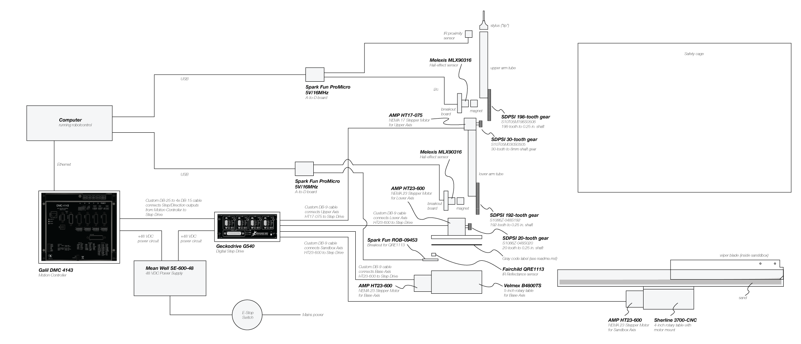

# Sketchbots

## Warnings and Disclaimers

**WARNING** **WARNING** **WARNING** **WARNING**

Moving machines can cause damage to personal property, personal injury or death. It is the responsibility of the reader of this document to take adequate safety precautions when operating, designing, or building any machinery, or when offering machinery to others for use.

None of the software, documents, firmware, schematics, drawings or other materials accompanying this document have been checked for errors, omissions or mistakes of any kind. Use it at your own risk.

Your use of the software, documents, firmware, schematics, drawings or other materials accompanying this document is governed by the [License Agreement](../../LICENSE.txt). Read it before proceeding.

**Safety Cage Warning**

Any machine buit with the parts described in this document **MUST NOT** be operated unless it is enclosed in a rated safety cage.

Copyright Notice:
Copyright 2013 Google Inc. All other copyrights and trademarks are property of their respective owners.

## Homebrew Drawing Machine based on Galil Econo Motion Controller (aka the 'HomebrewGalil' drawing machine)

The HomebrewGalil drawing machine is a "framework" for a 3-axis robot arm with an attached circular sandbox. Drawings are made by moving a stylus attached to the end of the arm around in the sand in the sandbox. The drawing machine can erase completed drawings by turning the circular sanbox below a fixed wiper blade.

Included below are drawings and other information for the incarnation of the HomebrewGalil arm used for the [Chrome Web Lab](http://www.chromeweblab.com/) at the [London Science Museum](http://www.sciencemuseum.org.uk).

The basic machine is controlled via a Galil Econo motion controller, such as the [DMC-41x3](http://www.galilmc.com/products/dmc-41x3.php). The machine gets its name from this motion controller because its robotcontrol DrawMachine module can communicate only to these particular Galil motion controllers (for other DrawMachines capable of communicating with other types of hardware, see the [Drawing Machines section of the robotcontrol reference](../../README.md#drawing-machines)).

The motion controller is connected to a microstepping controller, which is in turn connected to all of the stepper motors.

Each stepper motor has gearing to increase torqueue and motion precision.

The drawing machine also uses sensors to provide feedback to robotcontrol. The sensors used are:
* a hall-effect position sensor on the upper axis
* a hall-effect position sensor on the lower axis
* a proximity sensor on the stylus (used to determine the current depth of the sand)
* an IR reflectance sensor and gray code disc used as an encoder for the base axis

A step-by-step construction guide for this type of machine is beyond the scope of this readme. However, experienced engineers interested in a stepper-based (as opposed to servo-based) design should find sufficient information herein to construct a compatible drawing machine.

**There may be serious errors or omissions in these documents. Use at your own risk and post questions/corrections in the [issues section](../../../issues).**

The following materials are included here:

* [arm_solidworks](arm_solidworks) - Solidworks models for the body of the HomebrewGalil drawing machine used in the [Chrome Web Lab](http://www.chromeweblab.com/)
* [arm_renders](arm_renders) - onion-skin and shaded renders of the arm portion of the models from [arm_solidworks](arm_solidworks)
* [arm_tip_solidworks](arm_tip_solidworks) - Solidworks models for the stylus ("tip") used to actually draw in the sand
* [sensors/firmware](sensors/firmware) - firmware for the Arduino boards used to collect arm information from sensors
* [sensors/rotary_encoder_board](sensors/rotary_encoder_board) - Eagle and Gerber files for a breakout board for the Melexis' MLX90316 hall-effect position sensor IC
* [rotating_sandbox_base.pdf](rotating_sandbox_base.pdf) - Dimmensions of sandbox base
* [base_axis_graycode.pdf](base_axis_graycode.pdf) - Gray code artwork, used with IR reflectance sensor to create encoder for base axis

### Block Diagram

(click to enlarge)

Parts:

 Description | Part/Link
-------------|----------------
 Motion controller | [Galil DMC 4143](http://www.galilmc.com/products/dmc-41x3.php)
 Connects Step/Direction outputs from Motion Controller to Step Drive | Custom DB-25 to 4x DB-15 cable
 Digital step drive | [Geckodrive G540](http://www.geckodrive.com/geckodrive-step-motor-drives/g540.html)
 Connects G540 to Base Axis | Custom DB-9 cable
 NEMA 23 stepper motor for Base Axis | [Applied Motion Products HT23-600](http://www.applied-motion.com/products/stepper-motors/ht23-600)
 5-inch rotary table for Base Axis | [Velmex B4800TS](http://www.velmex.com/motor_rotary_tables.html#1)
 Line sensor breakout board | [Spark Fun ROB-09453](https://www.sparkfun.com/products/9453)
 IR reflectance sensor | [Fairchild Semiconductor QRE1113 ](https://www.sparkfun.com/products/9542)
 Gray code disc for use with IR reflectance sensor | [Print this PDF on a vinyl sticker](./base_axis_graycode.pdf)
 Connects G540 to Lower Axis | Custom DB-9 cable
 NEMA 23 stepper motor for Lower Axis | [Applied Motion Products HT23-600](http://www.applied-motion.com/products/stepper-motors/ht23-600)
 Lower Axis motor gear | [20-tooth to 0.25-in. shaft gear S1086Z-048S020](https://sdp-si.com/eStore/PartDetail.asp?Opener=Group&PartID=21715&GroupID=590)
 A-to-D board for lower arm sensing (mounted in base) | [SparkFun ProMicro 5V/16MHz Arduin-compatible board](https://www.sparkfun.com/products/11098)
 Hall-effect sensor breakout board | [See board artwork](sensors/rotary_encoder_board)
 Hall-effect sensor | [Melexis MLX90316](http://www.melexis.com/Assets/MLX90316-DataSheet-4834.aspx)
 Misc. support components for hall-effect sensor | [We just used the reference design, see datasheet](http://www.melexis.com/Assets/MLX90316-DataSheet-4834.aspx)
 Magnet (rotates with lower arm to provide hall-effect) | 6.35mm x 6.35mm cylindrical magnet
 Lower arm / gear assembly | [See models](arm_solidworks)
 Lower arm gear | [192-tooth to 0.25 in. shaft S1086Z-048S192](https://sdp-si.com/eStore/PartDetail.asp?Opener=Group&PartID=54214&GroupID=590)
 Lower arm tube | 35x60 1.8 wall thickness bike frame tube (shop around)
 Connects G540 to Upper Axis | Custom DB-9 cable
 NEMA 17 stepper motor for Upper Axis | [Applied Motion Products HT17-075](http://www.applied-motion.com/products/stepper-motors/ht17-075)
 Upper Axis motor gear | [30-tooth to 8mm shaft gear S10T05M030S0505](https://sdp-si.com/eStore/PartDetail.asp?Opener=Group&PartID=52663&GroupID=591)
 A-to-D board for upper arm sensing (mounted in lower arm) | [SparkFun ProMicro 5V/16MHz Arduin-compatible board](https://www.sparkfun.com/products/11098)
 IR proximity sensor | 
 Hall-effect sensor breakout board | [See board artwork](sensors/rotary_encoder_board)
 Hall-effect sensor | [Melexis MLX90316](http://www.melexis.com/Assets/MLX90316-DataSheet-4834.aspx)
 Misc. support components for hall-effect sensor | [We just used the reference design, see datasheet](http://www.melexis.com/Assets/MLX90316-DataSheet-4834.aspx)
 Stylus (custom part) | [See models](arm_tip_solidworks)
 Magnet (rotates with upper arm to provide hall-effect) | 6.35mm x 6.35mm cylindrical magnet
 Upper arm / gear assembly | [See models](arm_solidworks)
 Upper arm gear | [198-tooth to 8mm shaft gear S10T05M198S0508](https://sdp-si.com/eStore/PartDetail.asp?Opener=Group&PartID=47926&GroupID=591)
 Upper arm tube | 18x35 1.6 wall thickness bike frame tube (shop around)
 Connects G540 to Sandbox Axis | Custom DB-9 cable
 NEMA 23 stepper motor for Sandbox Axis | [Applied Motion Products HT23-600](http://www.applied-motion.com/products/stepper-motors/ht23-600)
 4-inch rotary table for Sandbox Axis | [Sherline 3700-CNC Rotary Table with Motor Mount](https://www.sherlinedirect.com/index.cfm?fuseaction=product.display&Product_ID=127&CFID=26040280&CFTOKEN=85880085)
 Sandbox pan (custom part) | [See dimensions here](rotating_sandbox_base.pdf)
 Sandbox wiper blade (custom part) | 
 Mounting hardware | [See models](arm_solidworks)
 Sand | We used fine casting sand from a foundry
 E-stop switch (connect to e-stop terminals on motion controller) | [OMRON STI Emergency Stop switch](http://www.grainger.com/Grainger/OMRON-STI-Emergency-Stop-Switch-2LCB6)
 Safety cage | Check local sources for "machine guarding" products

### Tips for connecting the Galil DMC-41x3 motion controller

The computer, and the robotcontrol software in particular, communicate with the motion controller via an Ethernet connection. Out of the box, however, the motion controller has a dynamic IP address.

Because the robotcontrol software needs to be able to open a connection to the motion controller on its own, we need to give the motion controller an IP address that we know will not change. Later we will record this IP address in the robotcontrol configuration file.

1. For the simplest setup, set up the computer's Ethernet port a static IP address. This will allow us to directly cable it to the motion controller, which we will also give a static IP address.
   * Assign the computer's Ethernet connection an IP of **192.168.3.7** and a subnet mask of **255.255.255.0**.
3. Download and install **GalilTools** for your operating system system from [this page](http://www.galilmc.com/support/software-downloads.php). You do **not** need the full version to get your Sketchbot running. The lite version is fine.
4. Connect an Ethernet cable between the computer's Ethernet port (the one you set to use a static IP) and the motion controller.
    * **Note**: Depending on the type of computer you have you may need a [cross-over Ethernet cable](https://www.google.com/search?q=cross-over+cable) to directly connect to the motion controller. Recent Apple laptops, for example, do not need a cross-over cable because they can automatically cross-over inside the computer. Other models may need such a cable.
5. Connect the power to the Galil motion controller
6. Start **GalilTools** on the computer.
7. The **Connections** dialog box should appear.
8. Look on the **No IP Address** tabs and find your motion controller. Select it from the list and click the **Connect** button.
    * Select the motion controller on the **No IP Address** list and enter an IP of **192.168.3.3**.
    * **Troubleshooting**: If you do not see your motion controller on the **No IP Address** tab, check on the **Available** tab. If you still do not see it, then check the cable. Still not working? Refer to the [Galil Tools manual](http://www.galilmc.com/support/manuals/galiltools/galiltools.pdf) and the [the motion controller manual](http://www.galilmc.com/support/manuals/man41x3.pdf).
9. Click the **Assign** button to set the controller's IP and save the setting to its non-volatile memory.
10. The motion controller should disappear from the **No IP Address** tab and appear on the **Available** tab.
11. Click **Cancel** to close the **Connect** dialog box.
12. Exit the **GalilTools** software.

### Tips for connecting and installing the sensor firmware

1. Download and install [the latest version of the Arduino IDE](http://arduino.cc/en/main/software).
2. Download and uncompress the [Arduino metro library](http://playground.arduino.cc/code/metro)
3. Move the **Metro** folder into your Arduino **libraries** folder. See [these instructions for help locating the **libraries** folder](http://arduino.cc/en/Guide/Libraries).
4. Download and uncompress the SparkFun ProMicro add-on for the Arduino IDE from [here](http://dlnmh9ip6v2uc.cloudfront.net/datasheets/Dev/Arduino/Boards/SF32u4_boards.zip). You should end up with a folder called **SF32u4_boards**.
5. Go into your Arduino sketchbook folder. To find the location of this folder, start the Arduino IDE and go to the Preferences window. The path will be listed at the top of the Preferences window. **Important:** You should exit the Arduino IDE after determining the location of your sketchbook.
6. Inside your sketchbook folder, create a folder called **hardware** Skip this step if a hardware folder already exists.
7. Move the **SF32u4_boards** folder you obtained in step 4 into the **hardware** folder.
8. Connect a USB cable between the **upper arm** Arduino and the computer.
    * **Important**: Note which USB port you have plugged the Arduino into. If you need to disconnect the board, be sure to plug it back into the same port. The port names assigned to Arduinos on Linux and Mac OS X are tied to the physical port, not to the Arduino board. If you were to connect the same board to another port it would be assigned a different name. Later, we will need to configure robotcontrol to use this port so we don't want it to change.
9. Start the Arudino IDE
10. From the **File** menu, select **Open...**. Open [upper_arm_arduino_fw.ino](firmware/Sketchbots/sw/firmware/upper_arm_arduino_fw/upper_arm_arduino_fw.ino) from the [**Sketchbots/sw/firmware/upper_arm_arduino_fw** folder](firmware/Sketchbots/sw/firmware/upper_arm_arduino_fw/upper_arm_arduino_fw).
11. From the Arduino IDE **Tools** menu, select **Board** and then **SparkFun Pro Micro 5V/16MHz**. Make sure that this is the name. Other similarly-named board profiles may compile, but will not work later.
    * **Troubleshooting**: If you do not see an option for the ProMicro in the list, check that the **SF32u4_boards** folder is inside of the **hardware** folder inside your Arduino sketchbook folder. Note that, if you move libraries around while the Arduino IDE is running, you will need to restart the Arduino IDE before the changes will take effect.
12. From the **Tools** menu, select **Serial Port**. Select the port named something like **/dev/cu.usbmodemXXXXXX** (where XXXXXX is a number in hexadecimal).
    * **Note**: This is the name of the **upper arm** sensor serial port. You will need this information later.
13. From the **File** menu, select **Upload**. The firmware will be compiled and, then, after a few moments the Arduino IDE should report that it is done uploading the firmware to the board.
    * **Troubleshooting**: If you receive an error that "'Metro' does not name a type" check that step 3 was done correctly. This means that the Arduino compiler cannot find the Metro library.
    * **Troubleshooting**: If you receive an error similar to "'Serial1' was not defined in this scope" make sure that you have the ProMicro selected in the **board** menu. See step 11.
14. Make sure you took note of the name of the **upper arm** serial port (see step 12).
15. Exit the Arduino IDE.
16. Connect a USB cable between the **lower arm** Arduino and the computer.
17. Start the Arudino IDE
18. From the **File** menu, select **Open...**. Open [lower_arm_arduino_fw.ino](firmware/Sketchbots/sw/firmware/lower_arm_arduino_fw/lower_arm_arduino_fw.ino) from the [**Sketchbots/sw/firmware/lower_arm_arduino_fw** folder](firmware/Sketchbots/sw/firmware/lower_arm_arduino_fw/lower_arm_arduino_fw).
19. Make sure that the **Board** menu still shows **SparkFun Pro Micro 5V/16MHz** selected.
20. From the **Tools** menu, in **Serial Port** select the port which has a different name from the one identified in step 12.
    * **Important**: Take note of this serial port name as the **lower arm** sensor port.
21. From the **File** menu, select **Upload**.
    * **Troubleshooting**: See step 13.
22. Exit the Arduino IDE, but leave the USB cables connected to the computer.

The Arduinos now have the correct firmware installed.

In the robotcontrol [ConfigParams.js](../../sw/robotcontrol/src/ConfigParams.js) file you will need to:

1. Locate the **UPPER_SERIAL_PORT** setting. Its value should be the full name of the **upper arm** serial port as identified in step 12 of the "Connect and install the arm sensor firmware" section.
2. Locate the **LOWER_SERIAL_PORT** setting. Its value should be the full name of the **lower arm** serial port as identified in step 20 of the "Connect and install the arm sensor firmware" section.
3. Locate the **MOTION_CONTROLLER_HOSTNAME** setting. Change the setting value to the IP address assigned in step 8 of the "Connect the Galil DMC-41x3 motion controller" section. Note that the IP address should be a string enclosed in 'quotes'.

