<!-- ------------ Begin LEGO part image references ------------------ -->
[lego-4297008]: http://cache.lego.com/media/bricks/5/1/4297008.jpg
[lego-4206482]: http://cache.lego.com/media/bricks/5/1/4206482.jpg
[lego-4210751]: http://cache.lego.com/media/bricks/5/1/4210751.jpg
[lego-4210667]: http://cache.lego.com/media/bricks/5/1/4210667.jpg
[lego-655826]: http://cache.lego.com/media/bricks/5/1/655826.jpg
[lego-4121715]: http://cache.lego.com/media/bricks/5/1/4121715.jpg
[lego-4297202]: http://cache.lego.com/media/bricks/5/1/4297202.jpg
[lego-4225033]: http://cache.lego.com/media/bricks/5/1/4225033.jpg
[lego-4548305]: http://cache.lego.com/media/bricks/4/1/4548305.jpg
[lego-4522939]: http://cache.lego.com/media/bricks/5/1/4522939.jpg
[lego-4297200]: http://cache.lego.com/media/bricks/5/1/4297200.jpg
[lego-4285634]: http://cache.lego.com/media/bricks/5/1/4285634.jpg
[lego-4210753]: http://cache.lego.com/media/bricks/5/1/4210753.jpg
[lego-4211709]: http://cache.lego.com/media/bricks/5/1/4211709.jpg
[lego-4210686]: http://cache.lego.com/media/bricks/5/1/4210686.jpg
[lego-4211432]: http://cache.lego.com/media/bricks/5/1/4211432.jpg
[lego-4211622]: http://cache.lego.com/media/bricks/5/1/4211622.jpg
[lego-370726]: http://cache.lego.com/media/bricks/5/1/370726.jpg
[lego-373726]: http://cache.lego.com/media/bricks/5/1/373726.jpg
[lego-4119589]: http://cache.lego.com/media/bricks/5/1/4119589.jpg

<!-- ------------ End LEGO part image references ------------------ -->

# Sketchbot Tutorial with Lego Mindstorms  NXT


**WARNING** **WARNING** **WARNING** **WARNING**

Moving machines can cause damage to personal property, personal injury or death. It is the responsibility of the reader of this document to take adequate safety precautions when operating, designing, or building any machinery, or when offering machinery to others for use.

None of the software, documents, firmware, schematics, drawings or other materials accompanying this document have been checked for errors, omissions or mistakes of any kind. Use it at your own risk.

Your use of the software, documents, firmware, schematics, drawings or other materials accompanying this document is governed by the [License Agreement](../LICENSE.txt). Read it before proceeding.

All trademarks are the property of their respective owners.

---

### Introduction

In this tutorial you will learn to use the Chrome Web Lab's Sketchbot open source Sketchbot library in order to build your very own web-controlled drawing machine!

Since building robots can be an expensive endeavor we will try to minimize cost (and complexity) by making a drawing robot using [Lego Mindstorms NXT](http://mindstorms.lego.com/).

Like its bigger brother, the Mindstorms Sketchbot will use a 3-axis arm to manipulate a physical 'stylus' in order to tranposes a vector-based image onto a two-dimensional surface like paper.

After assembling Lego Mindstorms NXT drawing robot, getting the dependencies installed on your machine and running the Sketchbot code, the library will handle everything from the image capture, to the conversion to vector-based machine code (i.e. [gcode](http://en.wikipedia.org/wiki/G-code)) that the drawing robot can understand.

For a full description of the history and concept of the project see [this page](https://github.com/GoogleChrome/ChromeWebLab/tree/master/Sketchbot).

Here's an example video of what you can expect after getting everything setup!

/////////// **TODO: Add Video Here** ///////////

---

*NOTE:*

*The Lego Mindstorms NXT sketchbot is NOT a high-precision drawing robot--far from it. This is primarily due to its physical motor limitations and loose tolerances. However, it does demonstrate how a complete drawing system works, by going from web interface to physical sketch and providing a great jumping off point for anyone interested in building more advanced drawing machines using the Chrome Web Lab's Sketchbot library.*

---

###References

* [Lego Mindstorms NXT](http://mindstorms.lego.com/)
* [Inverse Kinematics](http://en.wikipedia.org/wiki/Inverse_kinematics)
* [GCode](http://en.wikipedia.org/wiki/G-code))
* [Chrome Experiments](http://www.chromeexperiments.com/)

---

###PART 1: Gather Materials

The first step is to acquire all of the parts we will need to build this project. 


* LEGO® MINDSTORMS® NXT Kit (such as [LEGO kit number 8527](http://www.brickset.com/detail/?Set=8527-1))
* Pen, Pencil or Brush to attach to the stylus
* Paper or other drawing surface--try sand if you like
* A good metric ruler or, better still, a good metric [dial caliper](http://en.wikipedia.org/wiki/Caliper#Dial_caliper). Yes, you should use metric units.

---

###PART 2: Software Configuration

First, we will set up the software needed for this project. This will be done on a computer, as well as on the "NXT brick" from the LEGO kit.

The NXT brick is the motion controller for LEGO's robotics system and handles taking higher level motion commands and moving the motors appropriately. The NXT Brick comes from LEGO with a stock firmware installed. Happily, LEGO freely allows builders to install their own new firmware. We will use the community-developed [pbLua firmware](http://hempeldesigngroup.com/lego/pblua) rather than the stock LEGO firmware.

1. Follow the instructions in the [Getting Started Guide, Basic Setup section](https://github.com/GoogleChrome/ChromeWebLab/tree/master/Sketchbots#getting-started-basic-setup) for the main Sketchbot Library and follow the procedures there. Once you can verify the system works without any LEGOs attached head back.
2. If you haven't done so already, make sure that the basic LEGO Mindstorms NXT software is installed and running properly on your computer. Instructions are included in the Mindstorms NXT box and on [LEGO's web site](http://mindstorms.lego.com/en-us/support/buildinginstructions/8547/8547%20user%20guide%20english.aspx).
3. Follow [these instructions](http://hempeldesigngroup.com/lego/pblua/tutorial/pbluainstall/) to install the pbLua firmware on the NXT brick.
4. Open the [ConfigParams.js](sw/robotcontrol/src/ConfigParams.js) file from the [robotcontrol/src](sw/robotcontrol/src/) folder.
6. Locate the `DRAW_MACHINE_TYPE` setting. Make sure it is set as follows: ```DRAW_MACHINE_TYPE: "MindstormsNXT",``` 
7. If you built your drawing machine according to the instructions referenced in step 1, above, then the robot geometry settings included in ConfigParams.js can be used as-is. If you modified the machine or want to understand these settings in more detail, please see the [DrawMachine Geometry Configuration section](#drawmachine-geometry-configuration).
8. Connect the NXT brick to the computer via USB or Bluetooth. See your computer operating system's documentation for details on how to create a Bluetooth connection.
9. Determine the name of the serial port by looking in the **/dev** directory in a shell or Mac OS X terminal. For Bluetooth devices on Mac OS X, the port is usually called **/dev/cu.NXT-DevB**.
10. Back in ConfigParams.js, set the `MINDSTORMS_NXT__SERIAL_PORT` to the name of the serial port from step 9.
11. Save changes to ConfigParams.js.

> #### Stop and test
>
> Now we should re-test the entire system to make sure that it still works.
> 
> 1. In the shell, change to the [**robotcontrol/** folder](sw/robotcontrol) (one level up from the **src** folder).
> 2. Run `./start_robot_control`
> 3. You should see the following message in the console: `********************** Connected to MindstormsNXT drawing machine **********************`
> 4. You should also see "Sketchbot OK" on the Mindstorms NXT brick LCD display. **Troubleshooting**: If you do not see *both* the message in the console on the computer and on the LCD, then you may have the wrong serial port configured in ConfigParams.js. Review Step 9 above and try again.

> 5. Switch to the UI running in your browser. If the UI is not running, switch to App Engine Launcher, select *labqueue* and press the *Run* button. Click the *Browse* button to display the UI in your browser.
> 6. Click the *New from File* button
> 7. Select the [testpattern.png](sw/test/testpattern.png) file which is part of this repository. You can find it in the [sw/test](sw/test) folder.
> 8. Click the *Save* button
> 9. A few seconds later **robotcontrol** should pick up the new drawing task and begin commanding the drawing machine.
> 
> **Troubleshooting**: 
> 	* If **robotcontrol** does not detect the new drawing task then there may be a fundamental misconfiguration in **robotcontrol** itself. Review the [Getting Started: Basic Setup](#getting-started-basic-setup) instructions.
> 	* If **robotcontrol** detects the new task but the robot does not start drawing then review the troubleshooting tips for step 3 in this test procedure.
> 	* If the drawing machine starts drawing but does not draw correctly, you may need to check the physical build of the machine. Review the [build instructions here](hw/MindstormsNXT/README.md). You should also re-check the dimensional and gear ratio settings as shown in step 7, above.
> 

--

###PART 3: Assemble the Lego Sketchbot
The robot arm we will build looks like this:
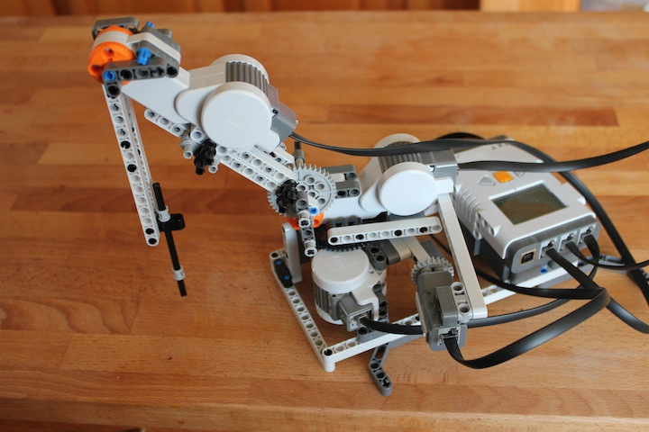

####Build the Base
We will start with the base from a robot arm designed by [Dave Parker](http://www.nxtprograms.com), then add a new arm section on top.
**Special thanks** to Dave for making such a great collection of Mindstorms projects available.

To build the base, [follow Dave's instructions through step 9 for Dave Parker's robot arm](http://www.nxtprograms.com/robot_arm/steps.html) (cached copy [here](http://webcache.googleusercontent.com/search?q=cache:4DkidHRrL44J:www.nxtprograms.com/robot_arm/steps.html+&cd=1&hl=en&ct=clnk&gl=us)) then **return here**. Don't do steps 10 or later.

####Build the Middle Arm Segment - Part 1
#####Parts
![Tacho Motor Assambled][lego-4297008] 
![Technic 3M Beam][lego-4210751] ![Technic 3M Beam][lego-4210751]
![Conn.Bush W.Fric./Crossale][lego-4206482] ![Conn.Bush W.Fric./Crossale][lego-4206482] ![Conn.Bush W.Fric./Crossale][lego-4206482] ![Conn.Bush W.Fric./Crossale][lego-4206482] 
![Technic Ang. Beam 4X2 90 Deg][lego-4210667] ![Technic Ang. Beam 4X2 90 Deg][lego-4210667]
![connector peg w. friction 3m][lego-655826] ![connector peg w. friction 3m][lego-655826]
![Connector Peg W. Friction][lego-4121715] ![Connector Peg W. Friction][lego-4121715] ![Connector Peg W. Friction][lego-4121715] ![Connector Peg W. Friction][lego-4121715]

#####Assembly
<a href="http://www.youtube.com/watch?v=oXg4AtbPvps" target="_blank">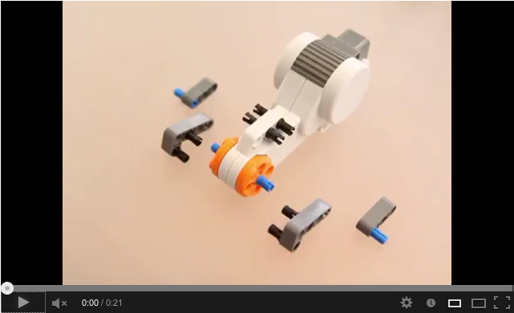</a>


####Build the Middle Arm Segment - Part 2
#####Parts
![Technic 9M Beam][lego-4297202] ![Technic 9M Beam][lego-4297202]
![Beam 3 M. W/4 Snaps][lego-4225033] ![Beam 3 M. W/4 Snaps][lego-4225033] ![Beam 3 M. W/4 Snaps][lego-4225033]
![connector peg w. friction 3m][lego-655826]
![Connector Peg W. Friction][lego-4121715] ![Connector Peg W. Friction][lego-4121715]

#####Assembly
<a href="http://www.youtube.com/watch?v=3XTaGui2jnM" target="_blank">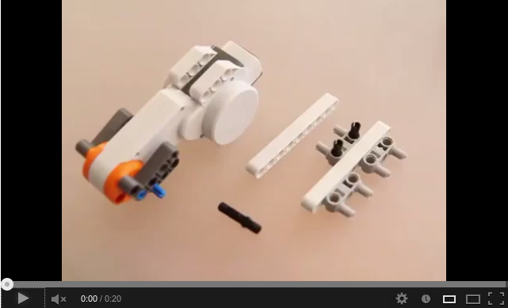</a>


####Build the Middle Arm Segment - Part 3
#####Parts
![Technic 15M Beam][lego-4548305]
![Technic 13M Beam][lego-4522939]
![Technic 11M Beam][lego-4297200]
![Beam 3 M. W/4 Snaps][lego-4225033] ![Beam 3 M. W/4 Snaps][lego-4225033] ![Beam 3 M. W/4 Snaps][lego-4225033]
![Connector Peg W. Friction][lego-4121715] ![Connector Peg W. Friction][lego-4121715]
![Conn.Bush W.Fric./Crossale][lego-4206482] ![Conn.Bush W.Fric./Crossale][lego-4206482]
![Gear Wheel 40T][lego-4285634]

#####Assembly
<a href="http://www.youtube.com/watch?v=9fZ-UtHjJJk" target="_blank">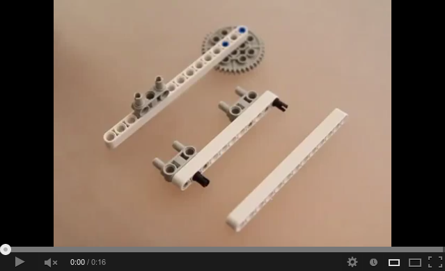</a>


####Build the Middle Arm Segment - Part 4
#####Parts
![Technic Ang. Beam 3X5 90 Deg.][lego-4210753]
![3M Connector Peg][lego-4211709]
![Technic 5M Beam][lego-4210686]
![Gear Wheel T=8, M=1][lego-4211432]
![Bush For Cross Axle][lego-4211622] ![Bush For Cross Axle][lego-4211622] ![Bush For Cross Axle][lego-4211622]
![Cross Axle 8M][lego-370726]
![Cross Axle 10M][lego-373726]

#####Assembly
<a href="http://www.youtube.com/watch?v=cgvkJ4SA5oA" target="_blank">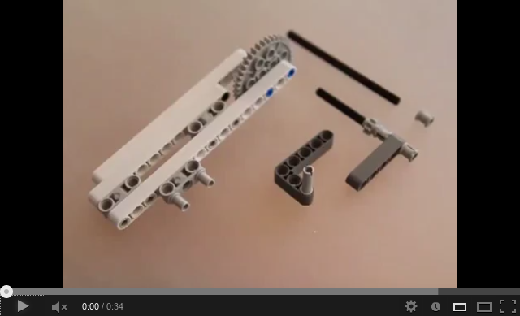</a>


####Build the Middle Arm Segment - Part 5
#####Parts
![Module Bush][lego-4119589] ![Module Bush][lego-4119589] ![Module Bush][lego-4119589]

#####Assembly
<a href="http://www.youtube.com/watch?v=VrQFO2uMBqI" target="_blank">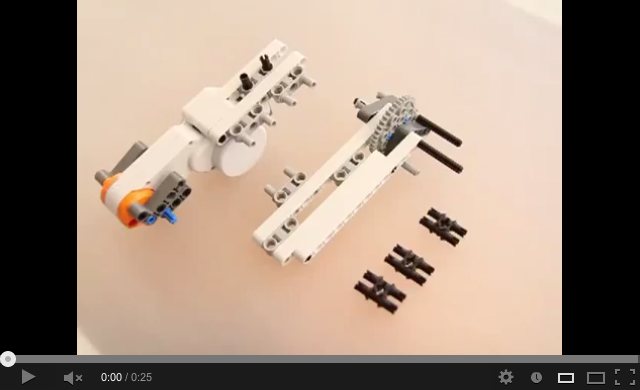</a>


####Connect the Middle Arm to the Base
#####Parts

#####Assembly
<a href="http://www.youtube.com/watch?v=P2TK4dvqAxU" target="_blank">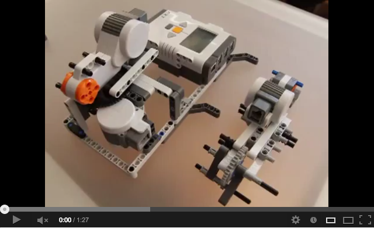</a>

####Test the Middle Arm Connection
#####Parts

#####Assembly
<a href="http://www.youtube.com/watch?v=qYW05iyw0Yk" target="_blank">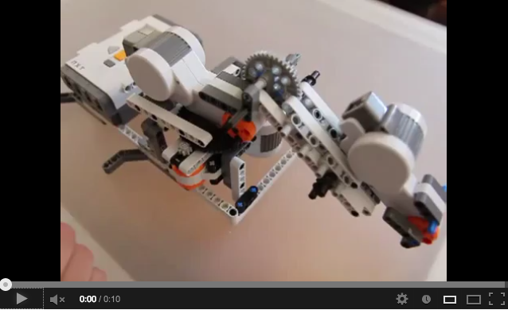</a>

####Build the Limit Switch
#####Parts

#####Assembly
<a href="http://www.youtube.com/watch?v=JPnMxgQ9hYE" target="_blank">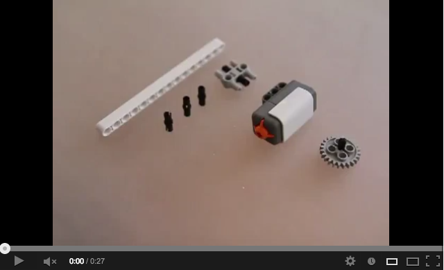</a>

####Connect the Limit Switch to the Base
#####Parts

#####Assembly
<a href="http://www.youtube.com/watch?v=-udeuvL_3iU" target="_blank">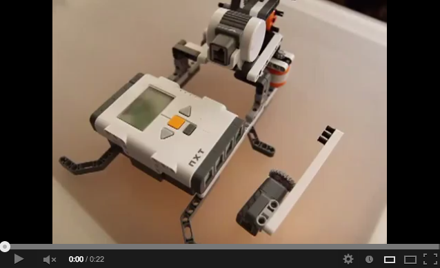</a>

####Build the Stylus
#####Parts

#####Assembly
<a href="http://www.youtube.com/watch?v=naYiju-byI0" target="_blank">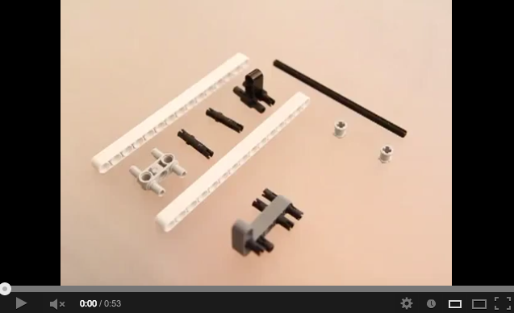</a>

####Connect the Stylus to the Middle Arm
#####Parts

#####Assembly
<a href="http://www.youtube.com/watch?v=Ie9yU_NviAk" target="_blank">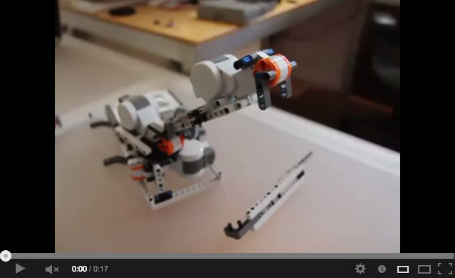</a>

####Connect the Cables
#####Parts

#####Assembly
<a href="http://www.youtube.com/watch?v=aOploTPSCBQ" target="_blank"></a>

###PART 4: Running

At this point you should be able to run the Sketchbot system on the computer and use the system as described [here](https://github.com/GoogleChrome/ChromeWebLab/blob/hardware-tutorials-dev/Sketchbots/README.md#putting-it-all-together).

###Troubleshooting Tips

* The Mindstorms system is battery hungry. If things are acting strangely, try using fresh batteries.
* If you are having communication problems between the computer and the NXT brick, try using USB instead of Bluetooth.

